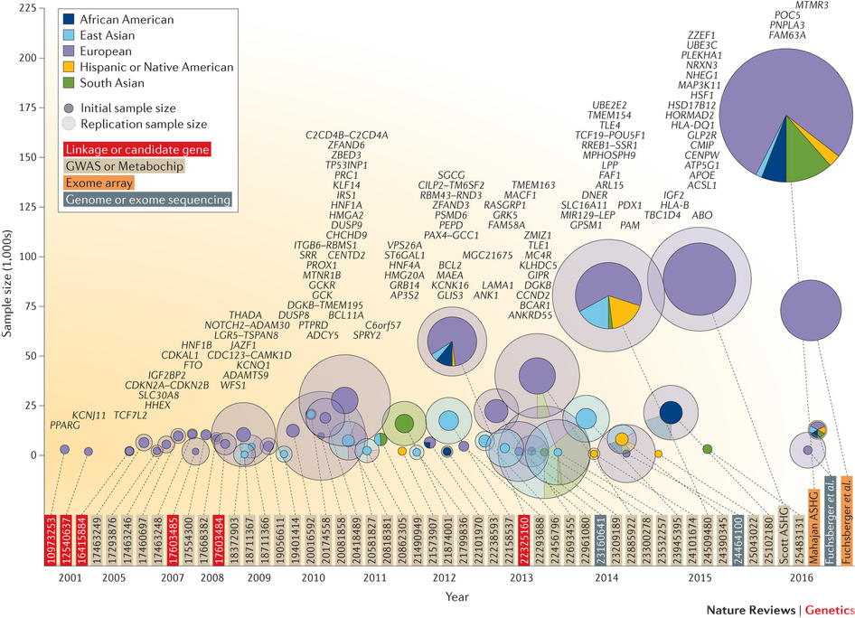
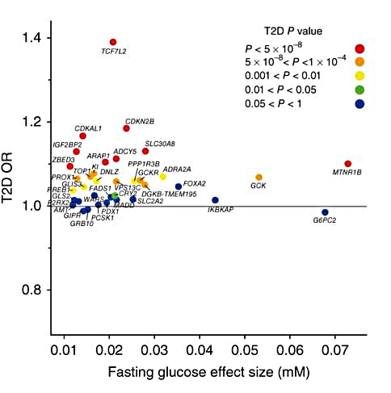
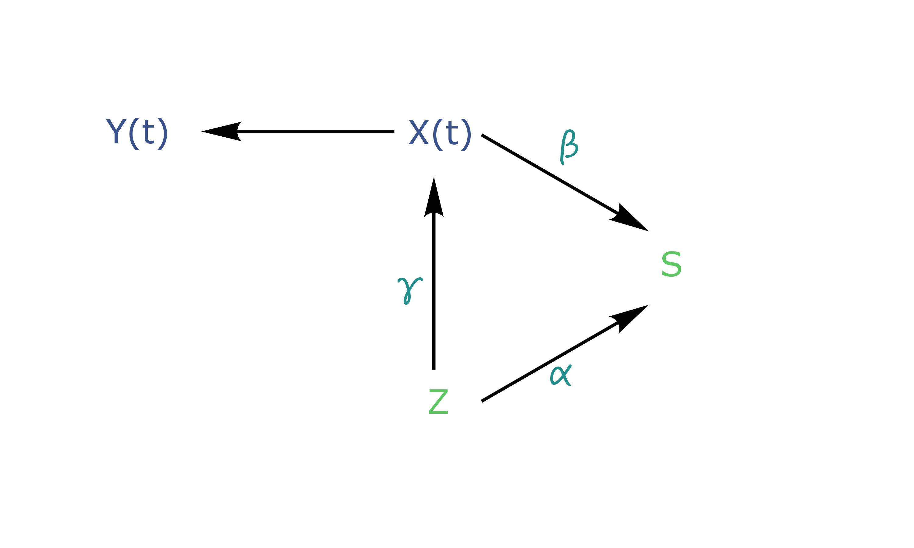
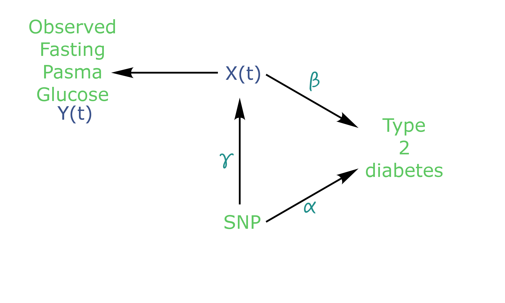
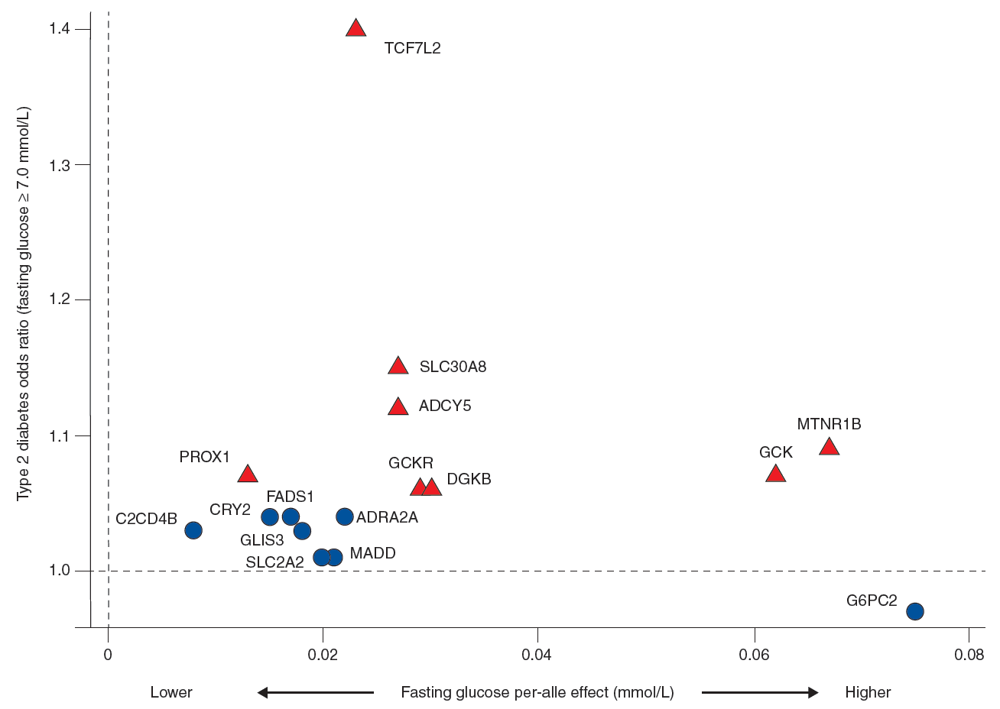

```{r setup, include = FALSE}
options(stringsAsFactors = FALSE)
# Sys.setlocale("LC_TIME", "english_united kingdom.1252")

output_directory <- ""

### Load packages and functions
library(tidyverse)
library(broom)
library(scales)
library(parallel)
library(grid)
library(knitr)
library(rmarkdown)
library(kableExtra)
library(gganimate)

devtools::source_url('https://github.com/mcanouil/DEV/raw/master/Rfunctions/theme_black.R')
devtools::source_url('https://github.com/mcanouil/DEV/raw/master/Rfunctions/pretty_kable.R')

options("width" = 80)
### Set knitr rmarkdown chunk options
opts_chunk$set(
  include = TRUE,
  echo = FALSE,
  warning = FALSE,
  message = FALSE,
  eval = params$eval,
  tidy = FALSE,
  crop = TRUE,
  autodep = TRUE,
  dpi = 120,
  fig.path = "./images/",
  cache = FALSE,
  # cache.path = NULL,
  width = 80,
  comment = "#>",
  results = "asis",
  fig.height = floor(16/9*10/3*10)/10 * 0.9, 
  fig.width = floor(10/3*10)/10* 0.9
)

### Define theme
theme_set(theme_black(base_size = 14))

# options(tibble.print_max = 3, tibble.print_min = 3)

require(ggraph)
jm_data <- new.env()
load(file = "Routput/DataArticle_20180102.Rdata", envir = jm_data)

```


## The Genetics of T2D and Associated Traits {.flexbox .vcenter}
```{r}
include_graphics(path = "images/ProkopenkoMetaboDiagram.png")
```
@marullo_insights_2014


## A lot of SNPs discovered, but ... {.flexbox .vcenter}




# Glycaemia and Type 2 Diabetes | A Genetic Joint Effect? {.flexbox .vcenter}

## Goals & Rationals {.flexbox .vcenter}

"In all cases, the glucose-raising allele was associated with increased risk of T2D, yet fasting glucose effect sizes and T2D ORs were weakly correlated"

## Goals & Rationals {.flexbox .vcenter}



## Goals & Rationals {.flexbox .vcenter}

* **Goals**  
    Find SNPs associated with an elevated glycaemia and T2D risk

* **Data (Metabochip)**  
    D.E.S.I.R.

* **Method**  
    Joint Model


## Joint Model | Overview

```{r}
data_arrows <- tribble(
  ~x, ~y, ~xend, ~yend, ~step,
  
  0.15, 1, 0.85, 1, 2,
  0.15, 1, 0.85, 1, 3,
  0.15, 1, 0.85, 1, 4,
  0.15, 1, 0.85, 1, 5,
  0.15, 1, 0.85, 1, 6,
  0.15, 1, 0.85, 1, 7,
  0.15, 1, 0.85, 1, 8,
  
  1.15, 1, 1.85, 0.55, 4,
  1.15, 1, 1.85, 0.55, 8,
  
  1.15, 0, 1.85, 0.45, 5,
  1.15, 0, 1.85, 0.45, 7,
  1.15, 0, 1.85, 0.45, 8,
  
  1, 0.1, 1, 0.9, 6,
  1, 0.1, 1, 0.9, 7,
  1, 0.1, 1, 0.9, 8
)
data_labels <- tribble(
  ~x, ~y, ~label, ~colour, ~step,
  1, 1, "Y(t)", 1, 1,
  2, 0.5, "S", 1, 1,
  1, 0, "Z", 1, 1,
  
  0, 1, "Y(t)", 1, 2,
  1, 1, "X(t)", 1, 2,
  2, 0.5, "T2D", 1, 2,
  1, 0, "SNP", 1, 2,
  0.5, 1.1, "epsilon", 2, 2,
  
  0, 1, "FG[obs]", 1, 3,
  1, 1, "FG[true]", 1, 3,
  2, 0.5, "T2D", 1, 3,
  1, 0, "SNP", 1, 3,
  0.5, 1.1, "epsilon", 2, 3,
  
  0, 1, "FG[obs]", 1, 4,
  1, 1, "FG[true]", 1, 4,
  2, 0.5, "T2D", 1, 4,
  1, 0, "SNP", 1, 4,
  0.5, 1.1, "epsilon", 2, 4,
  1.5, 0.9, "beta", 2, 4,
  
  0, 1, "FG[obs]", 1, 5,
  1, 1, "FG[true]", 1, 5,
  2, 0.5, "T2D", 1, 5,
  1, 0, "SNP", 1, 5,
  0.5, 1.1, "epsilon", 2, 5,
  1.5, 0.10, "alpha", 2, 5,
  
  0, 1, "FG[obs]", 1, 6,
  1, 1, "FG[true]", 1, 6,
  2, 0.5, "T2D", 1, 6,
  1, 0, "SNP", 1, 6,
  0.5, 1.1, "epsilon", 2, 6,
  0.9, 0.5, "gamma", 2, 6,
  
  0, 1, "FG[obs]", 1, 7,
  1, 1, "FG[true]", 1, 7,
  2, 0.5, "T2D", 1, 7,
  1, 0, "SNP", 1, 7,
  0.5, 1.1, "epsilon", 2, 7,
  0.9, 0.5, "gamma", 2, 7,
  1.5, 0.10, "alpha", 2, 7,
  
  0, 1, "FG[obs]", 1, 8,
  1, 1, "FG[true]", 1, 8,
  2, 0.5, "T2D", 1, 8,
  1, 0, "SNP", 1, 8,
  0.5, 1.1, "epsilon", 2, 8,
  1.5, 0.10, "alpha", 2, 8,
  0.9, 0.5, "gamma", 2, 8,
  1.5, 0.9, "beta", 2, 8
)
p <- ggplot() +
  theme(
    panel.grid = element_blank(), 
    axis.title = element_blank(), 
    axis.text = element_blank(), 
    axis.ticks = element_blank(), 
    panel.border = element_blank(),
    legend.position = "none"
  ) +
  geom_segment(
    data = data_arrows,
    mapping = aes(x = x, xend = xend, y = y,  yend = yend),
    colour = "white",
    arrow = arrow(length = unit(8, "point"), type = "closed"),
    lineend = "round",
    linejoin = "round"
  ) +
  geom_text(
    data = data_labels, 
    mapping = aes(x = x, y = y, label = label, colour = factor(colour)), 
    size = 6,
    parse = TRUE
  ) +
  scale_x_continuous(expand = expand_scale(mult = 0.2)) +
  scale_y_continuous(expand = expand_scale(mult = 0.2)) +
  scale_colour_viridis_d() +
  transition_states(
    states = step,
    transition_length = 0,
    state_length = 2,
    wrap = FALSE
  )

# options(gganimate.dev_args = list())
animate(
  plot = p, 
  # fps = 1,
  # duration = 8*8,
  nframes = 400,
  width = 800, 
  height = 450,
  res = 120,
  bg = ggplot2::theme_get()$plot.background$colour,
  renderer = ffmpeg_renderer(options = list(pix_fmt = "yuv420p", "r" = 0.9))
)

```


## Joint Model | Overview




## Joint Model | Overview




## Joint Model | Why?
Clinical studies goals:

    * to identify biomarker relavant to a disease;
    * TO identify the effect of a treatment on a disease (independently of the association with the biomarker).

Example:

    * __Biomarker__ fasting glucose
		* __Even__ Type 2 Diabetes


## Joint Model | Cox Model?

Cox model with time-varying covariate:
$$\begin{align}
h(t)=h_0(t) \exp(\beta Y(t) + \alpha Z)
\end{align}$$


## Joint Model | Limitations of the Cox Model

* Biomarker are mostly not measures at all times and/or event time.
    * Biormarkers are measured at determined time points ($t_{ij}$)
    * Biormarkers can have missing values over time
		    * $\Rightarrow$ Imputation? $\Rightarrow$ Bias introduction
		* Biormarkers are measured with some degree of error
      	* $\Rightarrow$ Noise in the biomarker trajectory ($Y_i(t_{ij}) \neq X_i(t_{ij})$)
    * Biomarker can be endogenous
      	* $\Rightarrow$ Biomarker's trajectory can change when the event occurs $\Rightarrow$ Bias introduction


## Modèle Joint | Avantages

* Tester l'effet d'un SNP simultanément sur:

    * le biomarqueur ($\gamma$);
    * la survenue de l'événement ($\alpha$);
    * le biomarqueur et la survenue de l'événement ($\beta\gamma+\alpha$).
    
* Gain de puissance statistique:

    * si $\beta\neq0$  (pour détecter un effet conjoint du SNP $\beta\gamma+\alpha\neq0$) \citep{chen_sample_2011};
    * par rapport à un modèle de "Cox étendu" (modèle de Cox avec covariable dépendante du temps).


## Modèle Joint | Formulation
Dans le Modèle Joint, deux composantes (modèles) sont utilisées:

    * un modèle longitudinal est utilisé pour modéliser la "vraie" trajectoire du biomarqueur (non-observable),
    * et est incorporé en tant que covariable (latente) dépendante du temps dans un modèle de survie.


## Modèle Joint | Formulation: Composante Longitudinale
Composante longitudinale: modèle (linéaire) mixte

Avec $T_i$, le temps d'événement et $C_i$, le temps de censure à droite: $$\begin{align}\tilde{T_i}&=\min(T_i, C_i),\end{align}$$

avec $t_{ij}\leq \tilde{T_i}$, $j=1, \cdots, n_i$, où  $n_i$ est le nombre de mesures.

Pour un individu $i$: $$\begin{align}Y_{i}(t_{ij})=X_{i}(t_{ij})+\epsilon_{i}(t_{ij})\end{align}$$

Où: 
$$\begin{align}\epsilon_{i}(t_{ij}) \sim \mathcal{N}(0, \sigma^2)\end{align}$$


## Modèle Joint | Formulation: Composante Longitudinale
Composante longitudinale: modèle (linéaire) mixte

Pour un individu $i$: $$\begin{align}Y_{i}(t_{ij})=X_{i}(t_{ij})+\epsilon_{i}(t_{ij})\end{align}$$

La trajectoire $X_i(t_{ij})$ peut être définie par un polynome, fonction du temps $t_{ij}$:
$$\begin{align}
X_{i}(t_{ij})=\theta_{0i} + \theta_{1i}t_{ij} + \cdots + \theta_{pi}t_{ij}^p &, & \boldsymbol\theta_p &\sim \mathcal{N}(\boldsymbol\mu_, \boldsymbol\Sigma)
\end{align}$$


Exemple: D.E.S.I.R.
Avec $\W_i$, la matrice des covariables d'ajustement (\^Age, Sexe et IMC) et $Z_i$, le génotype du SNP d'intérêt:
$$\begin{align}
Y_{i}(t_{ij})=\theta_{0i} + \theta_{1i}t_{ij} + \gamma Z_i + \delta W_i + \epsilon_{i}(t_{ij})
\end{align}$$


## Modèle Joint | Formulation: Composante de Survie
Composante de survie: modèle de Cox à risque proportionnel

Interrelation entre  $X_i(t)$, $T_i$ et $W_i$: 
$$\begin{align}
h_i(t)&=\lim_{dt \to 0} \frac{P\{t\leq T_i<t+dt|T_i\geq t, \bar{Y_i}(t), W_i\}}{dt}\\
&=h_0(t) \exp\{\beta X_{i}(t) + \eta W_i\}
\end{align}$$
            
Où $\bar{Y_i}(t)=\{Y_i(u),0 \leq u \leq t\}$ est l'historique de la trajectoire jusqu'au temps $t$.

Exemple: D.E.S.I.R.
Avec $W_i$, la matrice des covariables d'ajustement (\^Age, Sexe et IMC) et $Z_i$, le génotype du SNP d'intérêt:
$$\begin{align}
h_i(t_{ij})&=h_0(t_{ij}) \exp\{\beta X_{i}(t_{ij}) + \alpha Z_i + \eta W_i\}
\end{align}$$


## Modèle Joint | Test d'Hypothèse
Pour tester l'hypothèse nulle: $$\begin{align}H_0&:& \theta=\theta_0\\
H_1&:& \theta\neq\theta_0\end{align}$$

* __Test du Rapport de Vraisemblance__ $LRT=-2\{\ell(\hat{\theta}_0)-\ell(\hat{\theta})\}$

* Test de __Wald__ $W=(\hat{\theta}-\theta_0)^\top \mathcal{I}(\hat{\theta})(\hat{\theta}-\theta_0)$ (Univarié: $(\hat{\theta}_j-\theta_{0j})/\widehat{s.e.}(\hat{\theta}_j)$)

* __Test du Score__ $U=S^\top(\hat{\theta}_0)\{\mathcal{I}(\hat{\theta}_0)\}^{-1}S(\hat{\theta}_0)$


## Modèle Joint | Etude de Simulation: Objectifs
* Précision des estimateurs: RMSE (Root-Mean Square Error)

Root-Mean Square Error
$$\begin{align}
\operatorname{MSE}(\hat\theta)&= \operatorname{Biais}(\hat\theta)^2 + \operatorname{Var}(\hat\theta)\\
\operatorname{RMSE}(\hat{\theta})&=\sqrt{\operatorname{MSE}(\hat\theta)}\\
&=\sqrt{E\{(\hat{\theta}-\theta)^2\}}
\end{align}$$

* Faisabilité à l'échelle du génome: temps de calcul


## Modèle Joint | Etude de Simulation: Objectifs
* $\Rightarrow$ Comparaison à une approche en "deux-étapes" (TS) \citep{tsiatis_modeling_1995}:

"Two-Step"
* Première étape:

$$\begin{align}
Y_{i}(t)&=X_i(t)+ \epsilon_{i}(t)\\
X^*_{i}(t)&=E\{X_{i}(t)|\bar{Y_i}(t), T_i\geq t\}
\end{align}$$

* Deuxième étape:

$$\begin{align}
h_i(t)=h_0(t) \exp\{\beta X^*_{i}(t)\}
\end{align}$$


## Modèle Joint | Etude de Simulation: Génération des Données
Modèle longitudinale: $Y_{i}(t)=\theta_{0i} + \theta_{1i}t + \gamma Z_i + \epsilon_{i}(t)$

Modèle de survie: $h_i(t)=h_0(t) \exp\{\beta X_{i}(t) + \alpha Z_i\}$

Génération des temps d'événement: distribution exponentielle
$$\begin{gather}
  \lambda>0\\
  h_0(t)=\lambda\\
  H_0(t)=\lambda t\\
  H_i(T_i)=\int_0^{T_i}\lambda \exp(\beta X_i(t)+\alpha Z_i)dt\\
  T_i=\frac{1}{\beta\theta_{1i}}\log\left(1-\frac{\beta\theta_{1i}\times \log(1-u)}{\lambda \exp(\beta\theta_{0i}+(\beta\gamma+\alpha)Z_i)}\right),\  u\sim\mathcal{U}(0,1)\\
\end{gather}$$


## Modèle Joint | Etude de Simulation: Paramètres de Simulation

<div class="columns-2">
\citet{yaghootkar_recent_2013}


\citet{scott_large-scale_2012}

</div>
Taille d'effet $\beta$ et Odd Ratio respectivement pour la concentration de glucose et le diabète de type 2.


## Modèle Joint | Etude de Simulation: Paramètres de Simulation


# </img>__*Me?*__ {.flexbox .vcenter}

<div class="auto-fadein">
<script src="https://cdnjs.cloudflare.com/ajax/libs/uikit/3.0.0-rc.10/js/uikit.min.js"></script>
<script src="https://cdnjs.cloudflare.com/ajax/libs/uikit/3.0.0-rc.10/js/uikit-icons.min.js"></script>
<div class="columns-2">

<span class="uk-icon-button" uk-icon="icon: receiver; ratio: 1"></span>
    <a style="border-bottom: none; font-size: 80%; vertical-align: text-top;" href="" target="_blank">+33 (0) 374 00 81 29</a> 
    
<span class="uk-icon-button" uk-icon="icon: mail; ratio: 1"></span>
    <a style="border-bottom: none; font-size: 80%; vertical-align: text-top;" href="mailto:mickael.canouil@cnrs.fr" target="_blank">mickael.canouil@cnrs.fr</a> 

<span class="uk-icon-button" uk-icon="icon: home; ratio: 1"></span>
    <a style="border-bottom: none; font-size: 80%; vertical-align: text-top;" href="http://mickael.canouil.fr" target="_blank">mickael.canouil.fr</a> 

<span class="uk-icon-button" uk-icon="icon: linkedin; ratio: 1"></span>
    <a style="border-bottom: none; font-size: 80%; vertical-align: text-top;" href="https://www.linkedin.com/in/mickael-canouil" target="_blank">mickael-canouil</a> 

<span class="uk-icon-button" uk-icon="icon: github; ratio: 1"></span>
    <a style="border-bottom: none; font-size: 80%; vertical-align: text-top;" href="https://github.com/mcanouil" target="_blank">mcanouil</a> 

<span class="uk-icon-button" uk-icon="icon: twitter; ratio: 1"></span>
    <a style="border-bottom: none; font-size: 80%; vertical-align: text-top;" href="https://twitter.com/Coeos_" target="_blank">@ Coeos_</a> 

</div>
</div>
