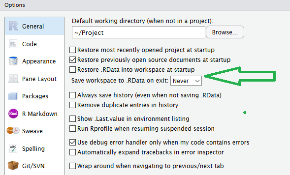
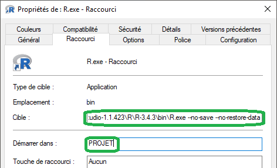
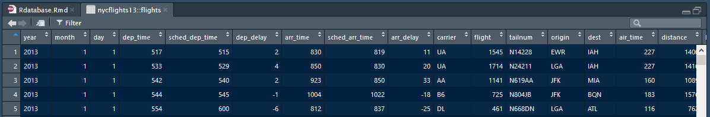
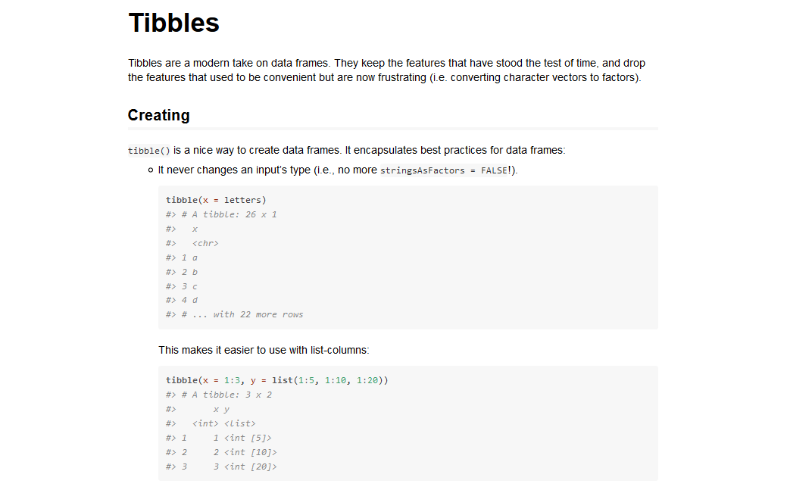
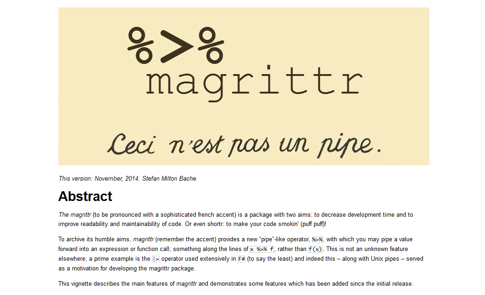
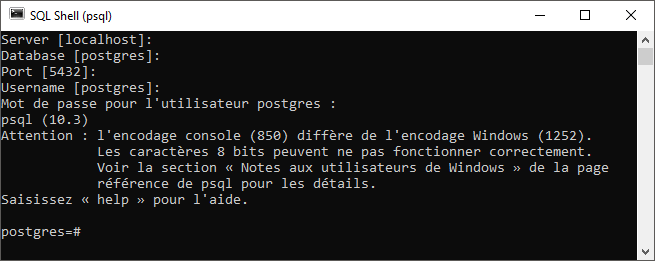
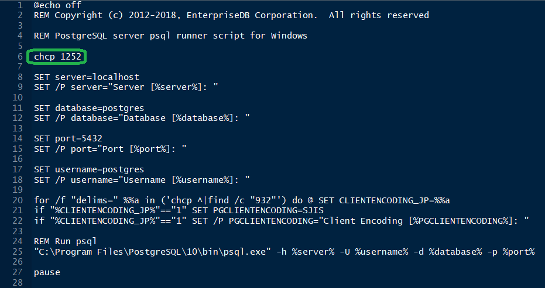

```{r setup, include = FALSE}
options(stringsAsFactors = FALSE)

### Load packages and functions
# library(parallel)
library(grid)
library(scales)
library(broom)
library(viridis)
# library(readxl)
# library(writexl)
# library(cowplot)
# library(tableone)
library(Hmisc)
library(knitr)
library(rmarkdown)
library(kableExtra)
# library(tidyverse)

invisible(sapply(list.files(path = "../../DEV/Rfunctions/", full.names = TRUE), source))

options("width" = 80)
### Set knitr rmarkdown chunk options
opts_chunk$set(
  include = TRUE,
  echo = TRUE,
  warning = TRUE,
  message = TRUE,
  tidy = FALSE,
  crop = TRUE,
  autodep = FALSE,
  dpi = params$dpi,
  fig.path = "./images/",
  cache = FALSE,
  cache.path = "./",
  width = getOption("width"),
  comment = "#>"
)

### Define theme
library(ggplot2)
theme_dark <- params$theme_dark
theme_set(theme_black(base_size = params$ggFontSize))
plot_grid <- hijack(plot_grid, theme_dark = theme_dark)
scale_colour_viridis <- hijack(scale_colour_viridis, option = "viridis", begin = 2/5, end = 1, direction = -1)
scale_fill_viridis <- hijack(scale_fill_viridis, option = "viridis", begin = 2/5, end = 1, direction = -1)

options(tibble.print_max = 3, tibble.print_min = 3)
```

# Préparer sa session {.flexbox .vcenter}

</img> 


## Trucs et astuces

*  Eviter de changer votre répertoire de travail avec `setwd()`,  
    c.-à-d. démarrer R directement au bon endroit ou définir un "Projet" dans Rstudio.
*  Ne pas utiliser le `.Rprofile` avec des options modifiant le comportant de R.
*  Désactiver la conversion automatique des chaînes de caractères en facteurs `options(stringsAsFactors = FALSE)`.
*  Ne pas utiliser `rm(list = ls())` pour "rafraichir" votre session.
*  Ne pas sauvegarder/charger `.Rdata` en quittant/démarrant votre session R.

<div class="columns-2">
</img>

</img>
</div>

# Le *tidyverse* {.flexbox .vcenter}

</img> 

## Qu'est-ce-que le *tidyverse* ?

Un ensemble d'outils basés sur une philosophie/grammaire commune.
```{r}
if (!"tidyverse"%in%rownames(installed.packages())) {
  install.packages("tidyverse")
}
library(tidyverse)
```


## Qu'est-ce-que le *tidyverse* ?

`library(tidyverse)` chargera les packages : 

* [readr](http://readr.tidyverse.org), importation.
* [tibble](http://tibble.tidyverse.org), classe d'objet "tibble".
* [dplyr](http://dplyr.tidyverse.org), manipulation.
* [tidyr](http://tidyr.tidyverse.org), mise en forme.
* [ggplot2](http://ggplot2.tidyverse.org), visualisation.
* [purrr](http://purrr.tidyverse.org), programmation.

Ces packages représentent la base du *tidyverse* et sont en constante évolution.
```{r, eval = FALSE}
tidyverse_update()
```


# *tibble* | comme un *data.frame*, mais en mieux ! {.flexbox .vcenter}

</img>

## Pré-requis
```{r tibble}
library(tidyverse)
```

```{r}
tidyverse_conflicts()
```

## Construire un *tibble*

```{r}
tibble(
  x = 1:5, 
  y = 1, 
  z = x ^ 2 + y
)
```

```{r, error = TRUE}
data.frame(
  x = 1:5, 
  y = 1, 
  z = x ^ 2 + y
)
```


## Construire un *tibble*
Et avec des noms de variables "exotiques" ?
```{r}
data.frame(`1`= 1:3)
```

```{r}
tibble(
  `;)` = 1:5, 
  `42` = "1", 
  `€` = `;)` ^ 2 + as.numeric(`42`)
)
```

## Afficher un *data.frame*
Les méthodes `show()` et `print()` :  
```{r}
as.data.frame(mtcars)
```
```{r}
print(as.data.frame(mtcars))
```

## Afficher un *tibble*
Les méthodes `show()` et `print()` : 
```{r}
as_tibble(mtcars)
```
```{r}
print(as_tibble(mtcars))
```

## Afficher un *tibble*
La fonction `rownames_to_column()` (et `column_to_rownames()`) : 
```{r}
as_tibble(rownames_to_column(mtcars))
```
```{r}
print(as_tibble(rownames_to_column(mtcars)))
```


## Afficher un *tibble* : les options
Changer les options d'affichages d'un *tibble* :

* via `options()`
```{r, eval = FALSE}
options(tibble.print_max = n, tibble.print_min = m, dplyr.print_min = p)
```
Afficher les `n` premières lignes, s'il y a plus de `m` ligneset sur `p` colonnes.

* via `print()`
```{r, eval = FALSE}
print(x = DF, n = n, width = p))
```

* dans R Studio via `View()`
```{r, eval = FALSE}
View(mtcars)
```



## Sélectionner une variable : `$`, `[` et `[[`

```{r}
mtcars$mpg
```

```{r}
mtcars[["mpg"]]
```

```{r}
mtcars[, "mpg"]
```

## Sélectionner une variable : `$`, `[` et `[[`

```{r}
as_tibble(mtcars)$mpg
```

```{r}
as_tibble(mtcars)[["mpg"]]
```

```{r}
as_tibble(mtcars)[, "mpg"]
```

## Assurer la rétro-compatibilité du code
De "vielles" fonctions limitées à la classe d'objet `data.frame` !
```{r}
tb <- as_tibble(mtcars)
class(tb)
class(as.data.frame(tb))
```


## Exercices

*  Comment savoir si un objet est de classe `tibble`, `data.frame`  ou encore `matrix` ?
*  Comment se comporte les opérations suivantes sur un `data.frame` et l'équivalent `tibble` ?  
    Quelle est la différence ?  
    ```{r, eval = FALSE}
    df <- data.frame(abc = 1, xyz = "a")
    df$x
    df[, "xyz"]
    df[, c("abc", "xyz")]
    ```
  
*  Comment extraire une colonne en utilisant une variable ? 
    ```{r}
    X <- "mpg"
    ```

## Exercices

*  Manipuler des noms de variables non-conventionnelles :
    ```{r}
    annoying <- tibble(
      `1` = 1:10,
      `2` = `1` * 2 + rnorm(length(`1`))
    )
    ```
    1.  Extraire la variable nommée `1`.
    2.  Tracer un nuage de points de `1` par rapport à `2`.
    3.  Ajouter une colonne nommée `3` contenant le résultat de `2` divisé par `1`.
    4.  Renommer les colonnes avec leurs noms littéral: `"un"`, `"deux"` et `"trois"`.

## Pour aller plus loin ...

```{r, eval = FALSE}
vignette("tibble")
```
</img>


# %>% | *magrittr* : "Ceci n'est pas un pipe." {.flexbox .vcenter}

</img>

## Pré-requis
```{r}
library(pryr)
```

```{r}
library(tidyverse)
```

```{r}
tidyverse_conflicts()
```

## Qu'est-ce-que le "pipe" ?
L'opérateur "pipe" (`%>%`) provient du package __magrittr__ développé par Stefan Milton Bache.

Par défaut `library(tidyverse)` s'occupe de charger l'opérateur "pipe".

__Exemple :__

*  `x %>% f` équivalent à `f(x)`
*  `x %>% f(y)` équivalent à `f(x, y)`
*  `x %>% f %>% g %>% h` équivalent à `h(g(f(x)))`
*  `f <- . %>% cos %>% sin` équivalent à `f <- function(.) sin(cos(.))`

Une aide à :

*  l'écriture du code.
*  la lisibilité du code.

Note : Raccourci `Ctrl+M` dans Rstudio pour faire apparaître un "pipe".


## Conserver les étapes
```{r, eval = FALSE}
x <- rnorm(25)
x1 <- sqrt(x)
x2 <- na.exclude(x1)
x3 <- x2<1
x4 <- table(x3)
x5 <- prop.table(x4)
x6 <- which.max(x5)
x7 <- names(x6)
```

<br>
Les inconvénients de cette écriture :

*  Obligation de nommer de façon explicite les différents objets.
*  Environnement surchargé d'objets peu utiles (`ls()`).
*  Utilisation plus importante de la mémoire vive ?
    ```{r, eval = FALSE}
    mtcars2 <- mtcars %>% mutate(cyl_fac = factor(cyl))
    
    pryr::object_size(mtcars)
    pryr::object_size(mtcars2)
    pryr::object_size(mtcars, mtcars2)
    ```

## Remplacer l'objet original 
```{r, eval = FALSE}
x <- rnorm(25)

x <- sqrt(x)
x <- na.exclude(x)
x <- x<1
x <- table(x)
x <- prop.table(x)
x <- which.max(x)
x <- names(x)
```

<br>
Les inconvénients de cette écriture :

*  Obligation relancer tout le code pour débuguer.
*  Répétition du nom de l'objet (14 fois).

## Composer l'appel aux fonctions
```{r, eval = FALSE}
x <- rnorm(25)

names(
  which.max(
    prop.table(
      table(
        na.exclude(
          sqrt(x)
        )<1
      )
    )
  )
)

names(which.max(prop.table(table(na.exclude(sqrt(x))<1))))
```

<br>
Les inconvénients de cette écriture :

*  L'ordre des appels va de l'intérieur vers l'extérieur.
*  Les arguments peuvent se situés "loin" de la fonction.


## Utiliser le "pipe" 
```{r, eval = FALSE}
x %>% 
  sqrt() %>% 
  na.exclude() %>% 
  `<`(1) %>% 
  table() %>% 
  prop.table() %>% 
  which.max() %>% 
  names()
```

<br>
A éviter si :

*  le nombre d'étapes devient important (Utiliser des objets intermédiaires avec des noms claires).
*  la séquence d'opération n'est pas linéaire.
*  les opérations nécéssitent plusieurs objets en entrée et/ou sortie.


## Pour aller plus loin ...

```{r, eval = FALSE}
vignette("magrittr")
```

</img>

# *readr* & *readxl* | Importer des données {.flexbox .vcenter}

<div class="columns-2">
</img>

</img>
</div>


## Pré-requis
```{r}
library(readxl)
```

```{r}
library(tidyverse)
```

```{r}
tidyverse_conflicts()
```

## Les fonctions de base de *readr*
Lire des tableaux rectangulaires :

* `read_csv()` : fichier avec séparateur virgule (".csv").
* `read_tsv()` : fichier avec séparateur tabulation.
* `read_table()` : fichier avec séparateur espace.
* `read_delim()` : forme générale (`delim = ""`).

Lire des données R (".rds") :

* `read_rds()` : surcouche de `readRDS()` (sans compression).

Lire des formats plus exotiques :
    
* `read_fwf()` : fichier à largeur fixe (nombre de caractères).
* `read_log()` : fichier de log provenant de serveur web Apache.

## Par rapport à celles de R : Entrée

* Nom homogène des fonctions et arguments .
* Plus rapide (moins rapide que *data.table*).
* ~~Auto-conversion en facteur.~~
* L'importation ne dépend pas des variables locales.
```{r}
locale()
```

## Par rapport à celles de R : Sortie

* Conversion des champs "date" au format `"%Y-%m-%d"`.
* Conversion des champs date/heure dans la norme ISO8601.  
    Par exemple : 
    * 07:57:59Z
    * 2018-04-13T07:57:59Z
* Noms des colonnes inchangés.
* Renvoie un objet *tibble*.
* Pas de nom de ligne.


## Dans la pratique | Lire un CSV avec *base*

```{r}
ratings <- read.csv(
  file = "./materials/ratings.csv"
)
str(ratings[0, ])
```

## Dans la pratique | Lire un CSV avec *readr*

```{r}
ratings <- read_csv(
  file = "./materials/ratings.csv"
)
```

## Dans la pratique | Lire un "texte" avec *base*

```{r}
read.csv(
  text = "a,b,c
    1,2,3
    4,5,6"
)
```

## Dans la pratique | Lire un "texte" avec *readr*

```{r}
read_csv(
  "a,b,c
  1,2,3
  4,5,6"
)
```

## Les arguments de *readr*

* L'argument `skip = n`
    ```{r}
    read_csv("Une ligne de métadonnées
      x,y,z
      1,2,3", skip = 1)
    ```
* L'argument `comment = "#"`
    ```{r}
    read_csv("# Une ligne de commentaires
      x,y,z
      1,2,3", comment = "#")
    ```

## Les arguments de *readr*

* L'argument `col_names = FALSE`
    ```{r}
    read_csv("1,2,3\n4,5,6", col_names = FALSE)
    ```
    
* Utiliser `col_names`pour nommer les colonnes
    ```{r}
    read_csv("1,2,3\n4,5,6", col_names = c("a", "b", "c"))
    ```
    
## Les arguments de *readr*

* L'argument `na = "."`
    ```{r}
    read_csv("a,b,c\n1,2,3\n4,.,6", na = ".")
    ```
    
* L'argument `col_types`
    ```{r}
    read_csv(
      "a,b,c\n1,x,2018-05-03\n4,y,2018-05-04", 
      col_types = list(col_integer(), col_character(), col_date(format = "%Y-%m-%d"))
    )
    ```

## Exercices
* Quelle fonction utiliseriez-vous pour importer un document avec `|` en séparateur ?
    
* Un fichier CSV peut parfois contenir une virgule dans un champ.  
    L'utilisation des guillemets simple `'` ou double `"` permet d'éviter que la virgule ne pose problème.
      1. Quel est le caractère par défaut utiliser par `read_csv()` ?  
      2. Quelle fonction et argument utiliser pour changer ce caractère ?
      3. Quelle fonction et avec quel valeur argument liriez-vous la chaîne suivante ?
    ```{r, eval = FALSE}
    "x,y\n1,'a,b'"
    ```
    
* Identifier les problèmes des lignes suivantes.  
    Que se passe t'il lors de l'exécution ?
    ```{r, eval = FALSE}
    read_csv("a,b\n1,2,3\n4,5,6")
    read_csv("a,b,c\n1,2\n1,2,3,4")
    read_csv("a,b\n\"1")
    read_csv("a,b\n1,2\na,b")
    read_csv("a;b\n1;3")
    ```

## Les alternatives à *readr* {.flexbox .vcenter}

```{r, echo = FALSE}
data.frame(
  check.names = FALSE,
  "Type de données" = rev(c("Logiciel Statistique", "Excel", 'Fichier "Text"')),
  Package = rev(c("__*haven*__", "__*readxl*__", "__*readr*__")),
  Alternatives = rev(c("foreign, sas7bdat, readstata13", "gdata, openxlsx, XLConnect, xlsx", "base, data.table"))
) %>% 
  kable(font_size = 18, align = "c", row.names = FALSE)
```

## Quelques benchmark {.flexbox .vcenter}
```{r, message = FALSE, echo = FALSE}
filename <- "./materials/ratings.csv"
microbenchmark::microbenchmark(
  {dta <- read.csv(filename)},
  {dta <- read_csv(filename)},
  {dta <- data.table::fread(filename)},
  times = 50, 
  unit = "s"
) %>% 
  as.data.frame() %>% 
  mutate(
    t = microbenchmark:::convert_to_unit(time, "s")
  ) %>% 
    ggplot(aes(x = expr, y = t, fill = expr)) +
      geom_violin(colour = "white") +
      scale_fill_viridis(discrete = TRUE, guide = FALSE) +
      labs(y = "Time (s)", x = NULL) +
      coord_flip()
```


## Exporter des données vers un fichier
*readr* inclut également des fonctions d'écriture `write_*()`.

* Les chaînes de caractères sont en UTF-8.
* Les dates et date/heure sont au format ISO8601

__Exemple__ :

* Dans le cas d'un fichier CSV
    ```{r, eval = FALSE}
    write_csv(x = ratings, path = "ratings.csv")
    ```

* Dans le cas d'un fichier Excel
    ```{r, eval = FALSE}
    library(writexl)
    write_xlsx(x = mtcars, path = "mtcars.xlsx")
    ```


# *dplyr* | Les rudiments {.flexbox .vcenter}

</img>

## Pré-requis
```{r}
library(tidyverse)
```

```{r}
tidyverse_conflicts()
```

```{r, echo = FALSE}
options(tibble.print_max = 10, tibble.print_min = 10)
```


## Les fonctions de base

5 (+1) fonctions clés de *dplyr* :

1. Sélectionner des observations par valeur (`filter()`).
2. Trier les lignes (`arrange()`).
3. Sélectionner des colonnes (`select()`).
4. Ajouter des colonnes en fonction des colonnes préexistantes (`mutate()`).
5. Résumer des valeurs (`summarise()`).

6. `group_by()` pour travailler sur des sous-ensembles d'un jeu de données.

Une syntaxe commune :

* le premier argument est un objet `data.frame`.
* Le second argument décrit l'action à effectuer (noms de variable sans guillemets).
* Renvoie un `data.frame` (ou `tibble`).


## Sélectionner des lignes
```{r, message = FALSE}
ratings <- read_csv(file = "./materials/ratings.csv")
```

```{r, results = "hold"}
### <b>
filter(ratings, `Your Rating` >= 9, `IMDb Rating` >= 9)
### </b>
```

```{r, message = FALSE, results = "hold"}
read_csv(file = "./materials/ratings.csv") %>% 
### <b>
  filter(`Your Rating` >= 9 & `IMDb Rating` >= 9)
### </b>
```


## Exercices


## Réordonner des lignes
```{r, message = FALSE, results = "hold"}
read_csv(file = "./materials/ratings.csv") %>% 
### <b>
  arrange(desc(`Date Rated`)) ### </b>
```


## Exercices


## Sélectionner des colonnes
Des aides à la sélection :

* `starts_with("abc")` : noms commençant par "abc".
* `ends_with("xyz")` : noms finissant par "xyz".
* `contains("ijk")` : noms contenant "ijk".
* `matches("(.)\\1")` : noms correspondant à l'expression régulière.
* `num_range("x", 1:3)`: noms correspondant à `x1`, `x2` et `x3`.

```{r, echo = FALSE}
options(tibble.print_max = 4, tibble.print_min = 4)
```

```{r, message = FALSE, results = "hold"}
read_csv(file = "./materials/ratings.csv") %>% 
  arrange(desc(`Date Rated`)) %>% 
### <b>
  select(Title, ends_with("Rating"))
### </b>
```

```{r, echo = FALSE}
options(tibble.print_max = 10, tibble.print_min = 10)
```

## Exercices


## Ajouter des colonnes
```{r, message = FALSE, results = "hold"}
read_csv(file = "./materials/ratings.csv") %>% 
  arrange(desc(`Date Rated`)) %>% 
### <b>
  mutate(Rating_is_better = `Your Rating`>=`IMDb Rating`) %>% 
### </b>
  select(Title, `Your Rating`, `IMDb Rating`, Rating_is_better)
```


## Exercices


## Résumer les données
```{r, message = FALSE, results = "hold"}
read_csv(file = "./materials/ratings.csv") %>%  
### <b>
  summarise(
    n_movies = n(),
    my_average_rating = mean(`Your Rating`),
    users_average_rating = mean(`IMDb Rating`),
    oldest_rating = min(`Date Rated`),
    newest_rating =  max(`Date Rated`)
  )
### </b>
```


## Exercices


## Utiliser `group_by()`
```{r, message = FALSE, results = "hold"}
read_csv(file = "./materials/ratings.csv") %>% 
  mutate(
    Year = lubridate::year(`Date Rated`)
  ) %>% 
  filter(Year!="2014") %>% 
### <b>
  group_by(Year) %>% 
### </b>
  summarise(
    n_movies = n(),
    my_average_rating = mean(`Your Rating`),
    users_average_rating = mean(`IMDb Rating`)
  ) %>% 
  arrange(desc(Year))
```


## Exercices


# *DBI* | Importer depuis une base de données  {.flexbox .vcenter}

</img>

## Pré-requis
```{r, results = "hold"}
library(DBI)
library(odbc)
```

```{r}
tidyverse_conflicts()
```


## Démarrer PostgreSQL
Lancez PostgreSQL via le raccourci "SQL Shell (psql)".

Laissez les valeurs par défaut (pressez "Entrée").

</img>


## Démarrer PostgreSQL
Pour retirer le message d'avertissement, ajouter "chcp 1252" dans le fichier ".bat".

</img>


## Commandes psql

* `\?` pour l'aide des commandes psql.
* `\q` quitter.
* `\h` aide des commandes sql.
* `\l` liste des bases de données.
* `\c` se connecter à une base.
* `\d` [nom] pour la description d'une table, d'un index, séquence, vue.
* `\d` liste des relations (tables, vues et séquences).
* `\i` nom_fichier.sql exécuter un fichier de commandes SQL.


## Base, utilisateur et droits en SQL

1. Créer un utilisateur
    ```{sql, eval = FALSE}
    CREATE ROLE rdb LOGIN password 'rdbpass';
    ```

2. Créer une base
    ```{sql, eval = FALSE}
    CREATE DATABASE datawarehouse;
    ```

3. Modifier le propriètaire d'une base
    ```{sql, eval = FALSE}
    ALTER DATABASE datawarehouse OWNER TO 'rdb';
    ```


## Base, utilisateur et droits en R

Identifier le driver de connection
```{r}
odbcListDrivers() %>% 
  filter(attribute=="DriverODBCVer") %>% 
  select(-attribute)
```


## Base, utilisateur et droits en R

Initier la connection
```{r}
con <- dbConnect(
  drv = odbc(),
  driver = "PostgreSQL ODBC Driver(UNICODE)",
  server = "localhost",
  port = 5432,
  database = "postgres",
  uid = "postgres",
  password = "password"
)
```
  
  
## Base, utilisateur et droits en R
* Créer un utilisateur
    ```{r}
    dbSendQuery(con, SQL("CREATE ROLE rdb LOGIN password 'rdbpass';"))
    ```
* Créer une base
    ```{r}
    dbSendQuery(con, SQL("CREATE DATABASE datawarehouse;"))
    ```


## Base, utilisateur et droits en R

* Modifier le propriètaire d'une base
    ```{r}
    dbSendQuery(con, SQL("ALTER DATABASE datawarehouse OWNER TO rdb;"))
    ```

* Se déconnecter de la base
    ```{r}
    dbDisconnect(con)
    ```
    
## Créer des tables en SQL depuis R
* Se connecter en tant que "rdb"
    ```{r}
    con <- dbConnect(
      drv = odbc(),
      driver = "PostgreSQL ODBC Driver(UNICODE)",
      server = "localhost",
      database = "datawarehouse",
      port = 5432,
      uid = "rdb",
      password = "rdbpass"
    )
    ```


## Créer des tables en SQL depuis R

* Lister les tables
    ```{r}
    dbListTables(con)
    ```

* Créer la table *mtcars*
    ```{r, results = "hold"}
    mtcars %>% 
      rownames_to_column(var = "car") %>% 
      mutate(const = gsub(" .*", "", car)) %>% 
      select(const, everything()) %>% 
      ### <b>
      dbWriteTable(con, "mtcars", .)
      ### </b>
    ```

* Lister les tables
    ```{r}
    dbListTables(con)
    ```
    

## Faire des requêtes en SQL depuis R

* Lister les champs d'une table
    ```{r}
    dbListFields(con, "mtcars")
```

* Lire une table
    ```{r}
    dbReadTable(con, "mtcars")
    ```


## Faire des requêtes en SQL depuis R

* Sélectioner les voitures du constructeur Mercedes
    ```{r}
    res <- dbSendQuery(con, "SELECT * FROM mtcars WHERE const='Merc'")
    dbFetch(res)
    ```

* Libérer les ressources occupées par la requête
    ```{r, results = "hold", message = FALSE}
    ### <b>
    dbClearResult(res)
    ### </b>
    dbDisconnect(con)
    ```


## Exercices

1. En tant qu'utilisateur "postgres", créez une base "movies".  
    Faire de "imdb_user" le propriètaire de cette base.
    ```{r, include = FALSE}
    con <- dbConnect(
      drv = odbc(),
      driver = "PostgreSQL ODBC Driver(UNICODE)",
      server = "localhost",
      database = "datawarehouse",
      port = 5432,
      uid = "postgres",
      password = "password"
    )
    dbSendQuery(con, SQL("CREATE ROLE imdb_user LOGIN password 'password';"))
    dbSendQuery(con, SQL("CREATE DATABASE movies;"))
    dbSendQuery(con, SQL("ALTER DATABASE Movies OWNER TO imdb_user;"))
    dbDisconnect(con)
    ```
    

2. En tant qu'utilisateur "imdb_user", exportez le fichier "ratings.csv" vers la base.
    Remplacez les espaces par des underscores dans les noms de colonnes.
    ```{r, message = FALSE}
    ratings <- read_csv(file = "./materials/ratings.csv") %>% 
      `colnames<-`(gsub(" ", "_", colnames(.)))
    ```
    ```{r, include = FALSE}
    con <- dbConnect(
      drv = odbc(),
      driver = "PostgreSQL ODBC Driver(UNICODE)",
      server = "localhost",
      database = "movies",
      port = 5432,
      uid = "imdb_user",
      password = "password"
    )
    dbWriteTable(con, "ratings", ratings)
    ```
3. Listez les noms de colonnes de la table créée.
    ```{r, include = FALSE}
    dbListFields(con, 'ratings')
    ```
4. Utilisez une requête SQL pour compter le nombre de films pour chaque note (`"Your Rating"`) et importer le résultat localement sous la forme d'un *tibble*.
    ```{r, include = FALSE}
    dbSendQuery(
      conn = con, 
      statement = SQL('SELECT "Your_Rating", COUNT(*) as count FROM ratings GROUP BY "Your_Rating";')
    ) %>% 
      dbFetch() %>% 
      as_tibble()
    ```
5. Sélectionnez les films notés entre le 1er janvier 2017 et le 31 décembre 2017.  
    Exportez cette table vers la base de données.
    ```{r, include = FALSE}
    dbSendQuery(
      conn = con, 
      statement = SQL(
        'SELECT * 
          FROM ratings 
          WHERE "Date_Rated">=\'2017-01-01\' AND "Date_Rated"<=\'2017-12-31\';'
      )
    ) %>% 
      dbFetch()%>% 
      dbWriteTable(con, "ratings2017", .)
    
    dbListTables(con)
    ```
    
```{r, include = FALSE}
dbDisconnect(con)
```


## Une base de données relationnel

* Schéma des tables du package *nycflights13*


## Une base de données relationnel
```{r, message = FALSE}
con <- dbConnect(
  drv = odbc(),
  driver = "PostgreSQL ODBC Driver(UNICODE)",
  server = "localhost",
  database = "datawarehouse",
  port = 5432,
  uid = "rdb",
  password = "rdbpass"
)
library(nycflights13)
dbSendQuery(con, "CREATE SCHEMA nycflights13;")
dbWriteTable(con, SQL("nycflights13.flights"), flights)
dbWriteTable(con, SQL("nycflights13.airports"), airports)
dbWriteTable(con, SQL("nycflights13.planes"), planes)
dbWriteTable(con, SQL("nycflights13.weather"), weather)
dbWriteTable(con, SQL("nycflights13.airlines"), airlines)
dbDisconnect(con)
```


## Clean PostgreSQL
```{r, echo = FALSE, message = FALSE}
con <- dbConnect(
  drv = odbc(),
  driver = "PostgreSQL ODBC Driver(UNICODE)",
  server = "localhost",
  port = 5432,
  database = "postgres",
  uid = "postgres",
  password = "password"
)

dbSendQuery(con, SQL("DROP DATABASE datawarehouse;"))
dbSendQuery(con, SQL("DROP ROLE rdb;"))

dbSendQuery(con, SQL("DROP DATABASE movies;"))
dbSendQuery(con, SQL("DROP ROLE imdb_user;"))

dbDisconnect(con)
```
