```{r setup, include = FALSE}
options(stringsAsFactors = FALSE)

### Load packages and functions
library(grid)
library(scales)
library(broom)
library(viridis)
library(Hmisc)
library(knitr)
library(rmarkdown)
library(kableExtra)

devtools::source_url('https://github.com/mcanouil/DEV/raw/master/R/theme_black.R')
devtools::source_url('https://github.com/mcanouil/DEV/raw/master/R/pretty_kable.R')

options("width" = 80)
### Set knitr rmarkdown chunk options
opts_chunk$set(
  eval = params$eval,
  include = TRUE,
  echo = TRUE,
  warning = TRUE,
  message = TRUE,
  tidy = FALSE,
  crop = TRUE,
  autodep = FALSE,
  dpi = 120,
  fig.path = "./images/",
  cache = FALSE,
  cache.path = "./",
  width = 80,
  comment = "#>",
  results = "hold",
  fig.height = 3.375, # floor(10/3 * 10)/10* 0.9, 
  fig.width = 6 # floor(16/9 * 10/3 *10)/10 * 0.9
)

### Define theme
library(ggplot2)

theme_set(theme_black(base_size = 14))

options(tibble.print_max = 3, tibble.print_min = 3)

# readr::write_csv(
#   x = readr::read_csv(file = "./materials/ratings.csv", locale = readr::locale(encoding = "Windows-1252")), 
#   path = "./materials/ratings.csv"
# )
```

```{sh, eval = FALSE, echo = FALSE, results = "hide"}
sudo apt-get update
sudo apt-get install postgresql-11 postgresql-client-11
# ps -ef | grep postgre
sudo service postgresql start
sudo su postgres
psql -d postgres -U postgres
\password postgres
\q
exit
```

```{sh, eval = FALSE, echo = FALSE, results = "hide"}
sudo su postgres;
psql -d postgres -U postgres;
DROP DATABASE test_data; 
DROP ROLE test_user; 
DROP DATABASE datawarehouse; 
DROP ROLE data_user; 
DROP DATABASE movies; 
DROP ROLE imdb_user;
\q;
exit
```


## Les Bases de Données et R {.flexbox .vcenter}

</img> 


# Préparer sa session {.flexbox .vcenter}

</img> 


## Trucs et astuces

*  Eviter de changer votre répertoire de travail avec `setwd()`,  
    c.-à-d. démarrer R directement au bon endroit ou définir un "Projet" dans R Studio.
*  Ne pas utiliser le `.Rprofile` avec des options qui modifie le comportement de R.
*  Désactiver la conversion automatique des chaînes de caractères en facteurs `options(stringsAsFactors = FALSE)`.
*  Ne pas utiliser `rm(list = ls())` pour "rafraichir" votre session.
*  Ne pas sauvegarder/charger `.Rdata` en quittant/démarrant votre session R.

<div class="columns-2">
</img>

</img>
</div>


# Le *tidyverse* {.flexbox .vcenter}

</img> 


## Qu'est-ce-que le *tidyverse* ?

Un ensemble d'outils basés sur une philosophie/grammaire commune.
```{r, message = FALSE}
if (!"tidyverse"%in%rownames(installed.packages())) {
  install.packages("tidyverse")
}
library(tidyverse)
```


## Qu'est-ce-que le *tidyverse* ?

`library(tidyverse)` chargera les packages : 

* [readr](http://readr.tidyverse.org), importation/exportation de données.
* [tibble](http://tibble.tidyverse.org), classe d'objet "tibble".
* [dplyr](http://dplyr.tidyverse.org), manipulation des données.
* [tidyr](http://tidyr.tidyverse.org), mise en forme des données.
* [ggplot2](http://ggplot2.tidyverse.org), visualisation des données.
* [purrr](http://purrr.tidyverse.org), programmation.

Ces packages représentent la base du *tidyverse* et sont en constante évolution.
```{r, eval = FALSE}
tidyverse_update()
```


# *tibble* | comme un *data.frame*, mais en mieux ! {.flexbox .vcenter}

</img>


## Pré-requis
```{r, message = FALSE}
library(tidyverse)
```

```{r, eval = FALSE}
tidyverse_conflicts()
```


## Construire un *tibble*

```{r}
tibble(
  x = 1:5, 
  y = 1, 
  z = x ^ 2 + y
)
```

```{r, error = TRUE}
data.frame(
  x = 1:5, 
  y = 1, 
  z = x ^ 2 + y
)
```


## Construire un *tibble*

* Et avec des noms de variables "exotiques" ?
    ```{r}
    data.frame(`1`= 1:3)
    ```
    
    ```{r}
    tibble(
      `;)` = 1:5, 
      `42` = "1", 
      `€` = `;)` ^ 2 + as.numeric(`42`)
    )
    ```


## Afficher un *data.frame*

* Les méthodes `show()` et `print()`. 
    ```{r}
    as.data.frame(mtcars)
    ```
    ```{r}
    print(as.data.frame(mtcars))
    ```


## Afficher un *tibble*

* Les méthodes `show()` et `print()` .
    ```{r}
    as_tibble(mtcars)
    ```
    ```{r}
    print(as_tibble(mtcars))
    ```

## Afficher un *tibble*

* La fonction `rownames_to_column()` (et `column_to_rownames()`).
    ```{r}
    as_tibble(rownames_to_column(mtcars))
    ```
    ```{r}
    print(as_tibble(rownames_to_column(mtcars)))
    ```


## Afficher un *tibble* : les options

Changer les options d'affichages d'un `tibble` :

* via `options()`
    ```{r, eval = FALSE}
    options(tibble.print_max = n, tibble.print_min = m, dplyr.print_min = p)
    ```
    Afficher les `n` premières lignes, s'il y a plus de `m` lignes et sur `p` colonnes.

* via `print()`
    ```{r, eval = FALSE}
    print(x = DF, n = n, width = p))
    ```

* dans R Studio via `View()`
    ```{r, eval = FALSE}
    View(mtcars)
    ```

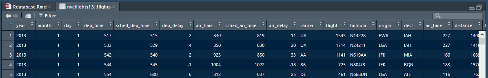</img>


## Sélectionner une variable : `$`, `[` et `[[`

```{r}
mtcars$mpg
```

```{r}
mtcars[["mpg"]]
```

```{r}
mtcars[, "mpg"]
```

## Sélectionner une variable : `$`, `[` et `[[`

```{r}
as_tibble(mtcars)$mpg
```

```{r}
as_tibble(mtcars)[["mpg"]]
```

```{r}
as_tibble(mtcars)[, "mpg"]
```


## Assurer la rétro-compatibilité du code

De "vielles" fonctions limitées à la classe d'objet `data.frame` !
```{r}
tb <- as_tibble(mtcars)
class(tb)
```
```{r}
class(as.data.frame(tb))
```


## Exercices (Partie I) {#exe}

*  Comment savoir si un objet est de classe `tibble`, `data.frame`  ou encore `matrix` ?
*  Comment se comporte les opérations suivantes sur un `data.frame` et l'équivalent `tibble` ?  
    Quelle est la différence ?  
    ```{r, eval = FALSE}
    df <- data.frame(abc = 1, xyz = "a")
    df$xyz
    df[["xyz"]]
    df[, "xyz"]
    df[, c("abc", "xyz")]
    ```
*  Comment extraire une colonne en utilisant une variable ? 
    ```{r}
    x <- "abc"
    ```


## Exercices (Partie I) {#exe}

*  Comment savoir si un objet est de classe `tibble`, `data.frame`  ou encore `matrix` ?
    ```{r, eval = FALSE}
    class(dta)
    ```


## Exercices (Partie I) {#exe}

*  Comment se comporte les opérations suivantes sur un `data.frame` et l'équivalent `tibble` ?  
    Quelle est la différence ?
    ```{r, eval = FALSE}
    df1 <- data.frame(abc = 1, xyz = "a")
    ```
    ```{r, eval = FALSE}
    df2 <- as_tibble(df1)
    ```
    ```{r, eval = FALSE}
    df1$xyz
    df1[["xyz"]]
    df1[, "xyz"]
    df1[, c("abc", "xyz")]
    ```


## Exercices (Partie I) {#exe}

*  Comment extraire une colonne en utilisant une variable ? 
    ```{r, eval = FALSE}
    x <- "abc"
    df1[, x]
    df1[[x]]
    ```
    ```{r, eval = FALSE}
    x <- "abc"
    df2[, x]
    df2[[x]]
    ```


## Exercices (Partie II) {#exe}

Manipuler des noms de variables non-conventionnelles :
```{r, eval = FALSE}
dta <- tibble(
  `1` = 1:10,
  `2` = `1` * 2 + rnorm(length(`1`))
)
```
* Récupérez la variable nommée `1`.
* Tracez un nuage de points de `1` par rapport à `2`.
* Créez un nouveau `tibble` avec une colonne nommée `3`, contenant le résultat de `2` divisé par `1`.
* Renommez les colonnes avec leurs noms littéral "un", "deux" et "trois", en construisant un nouveau `tibble`.


## Exercices (Partie II) {#exe}

Manipuler des noms de variables non-conventionnelles :
```{r, eval = FALSE}
dta <- tibble(
  `1` = 1:10,
  `2` = `1` * 2 + rnorm(length(`1`))
)
```
* Récupérez la variable nommée `1`.
    ```{r, eval = FALSE}
    dta$`1`
    ```
* Tracez un nuage de points de `1` par rapport à `2`.
    ```{r, eval = FALSE}
    plot(dta$`1`, dta$`2`)
    ggplot(data = dta, aes(x = `1`, y = `2`)) + geom_point(colour = "white")
    ```


## Exercices (Partie II) {#exe}

* Créez un nouveau `tibble` avec une colonne nommée `3`, contenant le résultat de `2` divisé par `1`.
    ```{r, eval = FALSE}
    dta <- tibble(
      `1` = 1:10,
      `2` = `1` * 2 + rnorm(length(`1`)),
      `3` = `2`/ `1`
    )
    ```
* Renommez les colonnes avec leurs noms littéral "un", "deux" et "trois", en construisant un nouveau `tibble`.
    ```{r, eval = FALSE}
    dta <- tibble(
      "un" = 1:10,
      "deux" = un * 2 + rnorm(length(un)),
      "trois" = deux / un
    )
    ```


## Pour aller plus loin ...

* Cheatsheets R Studio : [https://www.rstudio.com/resources/cheatsheets/](https://www.rstudio.com/resources/cheatsheets/)

```{r, eval = FALSE}
vignette(package = "tibble")
```

</img>


# %>% | *magrittr* : "Ceci n'est pas un pipe." {.flexbox .vcenter}

</img>


## Pré-requis

```{r, message = FALSE}
library(pryr)
```

```{r, message = FALSE}
library(tidyverse)
```

```{r, eval = FALSE}
tidyverse_conflicts()
```


## Qu'est-ce-que le "pipe" ?

L'opérateur "pipe" (`%>%`) provient du package *magrittr* développé par Stefan Milton Bache.

Par défaut `library(tidyverse)` s'occupe de charger l'opérateur "pipe".

__Exemple :__

*  `x %>% f` équivalent à `f(x)`
*  `x %>% f(y)` équivalent à `f(x, y)`
*  `x %>% f %>% g %>% h` équivalent à `h(g(f(x)))`
*  `f <- . %>% cos %>% sin` équivalent à `f <- function(.) sin(cos(.))`


## Pourquoi utiliser le "pipe" ?

Une aide à :

*  l'écriture du code.
*  la lisibilité du code.

</img>

__Note :__ Raccourci `Ctrl+M` dans R Studio pour faire apparaître un "pipe".


## Conserver les étapes

```{r, eval = FALSE}
x <- rnorm(25)
x1 <- sqrt(x)
x2 <- na.exclude(x1)
x3 <- x2<1
x4 <- table(x3)
x5 <- prop.table(x4)
x6 <- which.max(x5)
x7 <- names(x6)
```
<br>
Les inconvénients de cette écriture :

*  Obligation de nommer de façon explicite les différents objets.
*  Environnement surchargé d'objets peu utiles (`ls()`).
*  Utilisation plus importante de la mémoire vive ?
    ```{r, eval = FALSE}
    mtcars2 <- mtcars %>% mutate(cyl_fac = factor(cyl))
    
    pryr::object_size(mtcars)
    pryr::object_size(mtcars2)
    pryr::object_size(mtcars, mtcars2)
    ```


## Remplacer l'objet original

```{r, eval = FALSE}
x <- rnorm(25)

x <- sqrt(x)
x <- na.exclude(x)
x <- x<1
x <- table(x)
x <- prop.table(x)
x <- which.max(x)
x <- names(x)
```
<br>
Les inconvénients de cette écriture :

*  Obligation de relancer tout le code pour débuguer.
*  Répétition du nom de l'objet (14 fois).


## Composer l'appel aux fonctions

```{r, eval = FALSE}
x <- rnorm(25)

names(
  which.max(
    prop.table(
      table(
        na.exclude(
          sqrt(x)
        )<1
      )
    )
  )
)

names(which.max(prop.table(table(na.exclude(sqrt(x))<1))))
```
<br>
Les inconvénients de cette écriture :

*  L'ordre des appels va de l'intérieur vers l'extérieur.
*  Les arguments peuvent se situer "loin" de la fonction.


## Utiliser le "pipe" 

```{r, eval = FALSE}
x %>% 
  sqrt() %>% 
  na.exclude() %>% 
  `<`(1) %>% 
  table() %>% 
  prop.table() %>% 
  which.max() %>% 
  names()
```
<br>
A éviter si :

*  le nombre d'étapes devient important.  
    Utiliser des objets intermédiaires avec des noms claires.
*  la séquence d'opération n'est pas linéaire.
*  les opérations nécéssitent plusieurs objets en entrée et/ou sortie.


## Pour aller plus loin ...

```{r, eval = FALSE}
vignette(package = "magrittr")
```

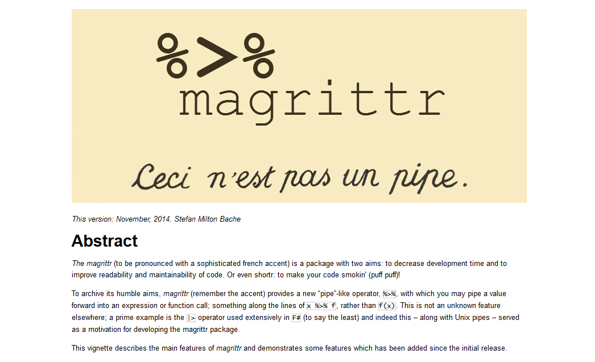</img>


# *readr* & *readxl* | Importer des données {.flexbox .vcenter}

<div class="columns-2">
</img>

</img>
</div>


## Pré-requis

* Fichier "ratings.csv" sur :  
    [https://github.com/mcanouil/PRESENTATION/tree/master/Rdatabase](https://github.com/mcanouil/PRESENTATION/tree/master/Rdatabase/materials)

```{r, message = FALSE}
library(readxl)
```

```{r, message = FALSE}
library(tidyverse)
```

```{r, eval = FALSE}
tidyverse_conflicts()
```


## Les fonctions de base de *readr*

Lire des tableaux rectangulaires :

* `read_csv()` : fichier avec séparateur virgule (".csv").
* `read_tsv()` : fichier avec séparateur tabulation (`\t`).
* `read_table()` : fichier avec séparateur espace.
* `read_delim()` : forme générale (`delim = ""`).

Lire des données R (".rds") :

* `read_rds()` : surcouche de `readRDS()` (sans la compression).

Lire des formats plus exotiques :
    
* `read_fwf()` : fichier à largeur fixe (nombre de caractères).
* `read_log()` : fichier de log provenant de serveur web Apache.


## Par rapport à celles de R : Entrée

* Nom homogène des fonctions et arguments.
* Plus rapide (moins rapide que *data.table*).
* ~~Auto-conversion en facteur.~~
* L'importation ne dépend pas des variables locales.
```{r}
locale()
```

## Par rapport à celles de R : Sortie

* Conversion des champs "date" au format `"%Y-%m-%d"`.
* Conversion des champs date/heure dans la norme ISO8601.  
    Par exemple : 
    * 07:57:59Z
    * 2018-04-13T07:57:59Z
* Noms des colonnes inchangés.
* Renvoie un objet `tibble`.
* Pas de nom de ligne.


## Dans la pratique | Lire un CSV avec *base*

```{r}
ratings <- read.csv(
  file = "./materials/ratings.csv"
)
str(ratings[0, ])
```


## Dans la pratique | Lire un CSV avec *readr*

```{r}
ratings <- read_csv(
  file = "./materials/ratings.csv"
)
```


## Dans la pratique | Lire un "texte" avec *base*

```{r}
read.csv(
  text = "a,b,c
    1,2,3
    4,5,6"
)
```


## Dans la pratique | Lire un "texte" avec *readr*

```{r}
read_csv(
  "a,b,c
  1,2,3
  4,5,6"
)
```


## Les arguments de *readr*

* L'argument `skip`.
    ```{r}
    read_csv("Une ligne de métadonnées
      x,y,z
      1,2,3", skip = 1)
    ```
* L'argument `comment`.
    ```{r}
    read_csv("# Une ligne de commentaires
      x,y,z
      1,2,3", comment = "#")
    ```


## Les arguments de *readr*

* L'argument `col_names = TRUE/FALSE`.
    ```{r}
    read_csv("1,2,3\n4,5,6", col_names = FALSE)
    ```
    
* Utiliser `col_names` pour nommer les colonnes.
    ```{r}
    read_csv("1,2,3\n4,5,6", col_names = c("a", "b", "c"))
    ```
    
## Les arguments de *readr*

* L'argument `na`.
    ```{r}
    read_csv("a,b,c\n1,2,3\n4,.,6", na = ".")
    ```
    
* L'argument `col_types`.
    ```{r}
    read_csv(
      "a,b,c\n1,x,2018-05-03\n4,y,2018-05-04", 
      col_types = list(col_integer(), col_character(), col_date(format = "%Y-%m-%d"))
    )
    ```


## Exercices {#exe}

* Quelle fonction utiliseriez-vous pour importer un fichier avec `|` en séparateur ?
    
* Un fichier CSV peut parfois contenir une virgule dans un champ.  
    Astuce : utilisez des guillemets simple `'` ou double `"`.
      1. Quel est le caractère par défaut utilisé par `read_csv()` ?  
      2. Quel est l'argument à utiliser pour changer ce caractère ?
      3. Quelle fonction et avec quels arguments liriez-vous la chaîne suivante ?
    ```{r, eval = FALSE}
    "x,y\n1,'a,b'"
    ```
    
* Identifiez les problèmes des lignes suivantes.  
    ```{r, eval = FALSE}
    read_csv("a,b\n1,2,3\n4,5,6")
    read_csv("a,b,c\n1,2\n1,2,3,4")
    read_csv("a,b\n\"1")
    read_csv("a,b\n1,2\na,b")
    read_csv("a;b\n1;3")
    ```


## Exercices {#exe}

* Quelle fonction utiliseriez-vous pour importer un fichier avec `|` en séparateur ?
    ```{r, eval = FALSE}
    read_delim(file = path, delim = "|")
    ```


## Exercices {#exe}

* Un fichier CSV peut parfois contenir une virgule dans un champ.  
    Astuce : utilisez des guillemets simple `'` ou double `"`.
    
    1. Quel est le caractère par défaut utiliser par `read_csv()` ? `"`
    2. Quel est l'argument à utiliser pour changer ce caractère ? `quote`
    3. Quelle fonction et avec quelle valeur argument liriez-vous la chaîne suivante ?
    ```{r, eval = FALSE}
    read_csv("x,y\n1,'a,b'", quote = "\'")
    read_delim("x,y\n1,'a,b'", delim = ",", quote = "\'")
    ```


## Exercices {#exe}

* Identifiez les problèmes des lignes suivantes.  
    ```{r, eval = FALSE}
    read_csv("a,b\n1,2,3\n4,5,6")
    read_csv("a,b,c\n1,2\n1,2,3,4")
    read_csv("a,b\n\"1")
    read_csv("a,b\n1,2\na,b")
    read_csv("a;b\n1;3")
    ```


## Les alternatives à *readr* {.flexbox .vcenter}

```{r, echo = FALSE}
data.frame(
  check.names = FALSE,
  "Type de données" = rev(c("Logiciel Statistique", "Excel", 'Fichier "Texte"')),
  Package = rev(c("__*haven*__", "__*readxl*__", "__*readr*__")),
  Alternatives = rev(c("foreign, sas7bdat, readstata13", "gdata, openxlsx, XLConnect, xlsx", "base, data.table"))
) %>% 
  pretty_kable(font_size = 18, align = "c", row.names = FALSE)
```


## Quelques benchmark ! {.flexbox .vcenter}

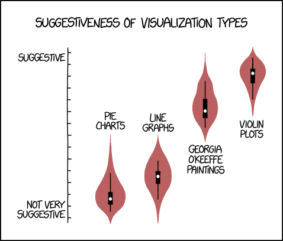</img>


## Quelques benchmark : Lecture  {.flexbox .vcenter}

```{r read_benchmark, message = FALSE, echo = FALSE}
filename <- "./materials/ratings.csv"
require(benchr)
benchr::benchmark(
  {dta <- utils::read.csv(filename)},
  {dta <- readr::read_csv(filename)},
  {dta <- data.table::fread(filename)}
) %>% 
  as.data.frame() %>% 
  mutate(
    expr = factor(
      gsub("\\{ *dta <- (.*)\\(.*", "\\1", expr),
      levels = c("utils::read.csv", "readr::read_csv", "data.table::fread")
    )
  ) %>% 
    ggplot(aes(x = expr, y = time, fill = expr)) +
      geom_violin(colour = "white") +
      scale_fill_viridis(discrete = TRUE, guide = FALSE) +
      labs(y = "Time (s)", x = NULL) +
      scale_y_continuous(limits = c(0, NA)) +
      coord_flip()
```


## Quelques benchmark : Ecriture {.flexbox .vcenter}

```{r write_benchmark, message = FALSE, echo = FALSE}
filename <- paste0(tempdir(), "/ratings.csv")
require(benchr)
benchr::benchmark(
  {utils::write.csv(x = ratings, file = filename, row.names = FALSE)},
  {readr::write_csv(x = ratings, path = filename)},
  {data.table::fwrite(x = ratings, file = filename)}
) %>% 
  as.data.frame() %>% 
  mutate(
    expr = factor(
      gsub("\\{ *(.*)\\(.*", "\\1", expr), 
      levels = c("utils::write.csv", "readr::write_csv", "data.table::fwrite"))
  ) %>% 
    ggplot(aes(x = expr, y = time, fill = expr)) +
      geom_violin(colour = "white") +
      scale_fill_viridis(discrete = TRUE, guide = FALSE) +
      labs(y = "Time (s)", x = NULL) +
      scale_y_continuous(limits = c(0, NA)) +
      coord_flip()
```


## Exporter des données vers un fichier

*readr* inclut également des fonctions d'écriture `write_*()`.

* Les chaînes de caractères sont en UTF-8.
    </img>
* Les dates et date/heure sont au format ISO8601.

__Exemple__ :

```{r, eval = FALSE}
readr::write_csv(x = ratings, path = "ratings.csv")
```
```{r, eval = FALSE}
writexl::write_xlsx(x = ratings, path = "ratings.xlsx")
```


# *dplyr* | Une grammaire de la manipulation des données {.flexbox .vcenter}

</img>


## *dplyr* : Le pipe et des fonctions utiles {.flexbox .vcenter}

</img>


## Pré-requis

```{r, message = FALSE}
library(tidyverse)
```

```{r, eval = FALSE}
tidyverse_conflicts()
```

```{r, echo = FALSE}
options(tibble.print_max = 10, tibble.print_min = 10)
```


## Les fonctions de base

5 (+1) fonctions clés de *dplyr* :

1. Sélectionner des observations par valeur (`filter()`).
2. Trier les lignes (`arrange()`).
3. Sélectionner des colonnes (`select()`).
4. Ajouter des colonnes en fonction des colonnes préexistantes (`mutate()`).
5. Résumer des valeurs (`summarise()`).

6. Travailler sur des sous-ensembles d'un jeu de données (`group_by()`).


## Les fonctions de base

Une syntaxe commune :

* Le premier argument est un objet `data.frame`.
* Le second argument décrit l'action à effectuer (noms de variable sans guillemets).
* Renvoie un `data.frame` (ou `tibble`).


## Sélectionner des lignes

```{r, message = FALSE}
ratings <- read_csv(file = "./materials/ratings.csv")
```

```{r}
### <b>
filter(ratings, `Your Rating` >= 9, `IMDb Rating` >= 9)
### </b>
```

```{r, message = FALSE}
ratings %>% 
### <b>
  filter(`Your Rating` >= 9 & `IMDb Rating` >= 9)
### </b>
```


## Exercices {#exe}

* Trouvez le film avec le plus grand nombre de notes.

* Trouvez les films contenant "shark" dans le titre (`grepl()`).

* Trouvez les films vus entre le 25 avril 2018 et le 3 mai 2018.

* Que fait la fonction `between()` ?


## Exercices {#exe}

* Trouvez le film avec le plus grand nombre de notes.
    ```{r, eval = FALSE}
    ratings %>% 
      filter(`Num Votes`==max(`Num Votes`))
    ```


## Exercices {#exe}

* Trouvez le film avec le plus grand nombre de notes.
    ```{r, eval = FALSE}
    ratings %>% 
      filter(`Num Votes`==max(`Num Votes`))
    ```
* Trouvez les films contenant "shark" dans le titre (`?grep`).
    ```{r, eval = FALSE}
    ratings %>% 
      filter(grepl(pattern = "shark", x = Title, ignore.case = TRUE))
    ```


## Exercices {#exe}

* Trouvez le film avec le plus grand nombre de notes.
    ```{r, eval = FALSE}
    ratings %>% 
      filter(`Num Votes`==max(`Num Votes`))
    ```
* Trouvez les films contenant "shark" dans le titre (`?grep`).
    ```{r, eval = FALSE}
    ratings %>% 
      filter(grepl(pattern = "shark", x = Title, ignore.case = TRUE))
    ```
* Trouvez les films vus entre le 25 avril 2018 et le 3 mai 2018.
    ```{r, eval = FALSE}
    ratings %>% 
      filter(`Date Rated`>="2018-04-25" & `Date Rated`<="2018-05-03")
    ```


## Exercices {#exe}

* Trouvez le film avec le plus grand nombre de notes.
    ```{r, eval = FALSE}
    ratings %>% 
      filter(`Num Votes`==max(`Num Votes`))
    ```
* Trouvez les films contenant "shark" dans le titre (`?grep`).
    ```{r, eval = FALSE}
    ratings %>% 
      filter(grepl(pattern = "shark", x = Title, ignore.case = TRUE))
    ```
* Trouvez les films vus entre le 25 avril 2018 et le 3 mai 2018.
    ```{r, eval = FALSE}
    ratings %>% 
      filter(`Date Rated`>="2018-04-25" & `Date Rated`<="2018-05-03")
    ```
* Que fait la fonction `between()` ?
    ```{r, eval = FALSE}
    ratings %>% 
      filter(between(`Date Rated`, as.Date("2018-04-25"), as.Date("2018-05-03")))
    ```


## Réordonner des lignes

```{r, message = FALSE}
ratings %>% 
### <b>
  arrange(desc(`Date Rated`))
### </b>
```


## Exercices {#exe}

* Réordonnez `ratings` selon les notes IMDb ("IMDb Rating") et utilisateur ("Your Rating").

* Réordonnez `ratings` selon les titres des films ("Title"), par ordre alphabétique.


## Exercices {#exe}

* Réordonnez `ratings` selon les notes IMDb ("IMDb Rating") et utilisateur ("Your Rating").
    ```{r, eval = FALSE}
    ratings %>% 
      arrange(desc(`IMDb Rating`), desc(`Your Rating`))
    ```

* Réordonnez `ratings` selon les titres des films ("Title"), par ordre alphabétique.
    ```{r, eval = FALSE}
    ratings %>% 
      arrange(Title)
    ```


## Sélectionner des colonnes

Des aides à la sélection :

* `starts_with("abc")` : noms commençant par "abc".
* `ends_with("xyz")` : noms finissant par "xyz".
* `contains("ijk")` : noms contenant "ijk".
* `matches("(.)\\1")` : noms correspondant à l'expression régulière.
* `num_range("x", 1:3)`: noms correspondant à "x1", "x2" et "x3".

```{r, echo = FALSE}
options(tibble.print_max = 4, tibble.print_min = 4)
```

```{r, message = FALSE}
ratings %>% 
  arrange(desc(`Date Rated`)) %>% 
### <b>
  select(Title, ends_with("Rating"))
### </b>
```

```{r, echo = FALSE}
options(tibble.print_max = 10, tibble.print_min = 10)
```


## Exercices {#exe}

* Sélectionnez les colonnes contenant "Date".

* Sélectionnez les colonnes contenant "Title", "Your Rating", "Date Rated" et "Release Date" par leur indice.


## Exercices {#exe}

* Sélectionnez les colonnes contenant "Date".
    ```{r, eval = FALSE}
    ratings %>% 
      select(contains("Date"))
    ```

* Sélectionnez les colonnes contenant "Title", "Your Rating", "Date Rated" et "Release Date" par leur indice.
    ```{r, eval = FALSE}
    ratings %>% 
      select(4, 2, 3, 12)
    ```


## Ajouter des colonnes

```{r, message = FALSE}
ratings %>% 
  arrange(desc(`Date Rated`)) %>% 
### <b>
  mutate(Rating_is_better = `Your Rating`>=`IMDb Rating`) %>% 
### </b>
  select(Title, `Your Rating`, `IMDb Rating`, Rating_is_better)
```


## Exercices {#exe}

* Calculez la moyenne des notes "Your Rating" et "IMDb Rating".
    
* Ajoutez les mois "Month" et jours "Day" à partir de "Date Rated" (`?lubridate`).

  
## Exercices {#exe}

* Calculez la moyenne des notes "Your Rating" et "IMDb Rating".
    ```{r, eval = FALSE}
    ratings %>% 
      mutate(`Avg Rating` = (`Your Rating`+`IMDb Rating`)/2)
    ```
    
* Ajoutez les mois "Month" et jours "Day" à partir de "Date Rated" (`?lubridate`).
    ```{r, eval = FALSE}
    ratings %>% 
      mutate(
        Month = lubridate::month(`Date Rated`),
        Day = lubridate::day(`Date Rated`)
      )
    ```


## Résumer les données

```{r, message = FALSE}
read_csv(file = "./materials/ratings.csv") %>%  
### <b>
  summarise(
    n_movies = n(),
    my_average_rating = mean(`Your Rating`),
    oldest_rating = min(`Date Rated`),
    newest_rating =  max(`Date Rated`)
  )
### </b>
```


## Exercices {#exe}

* Calculez la moyenne, l'écart-type, le minimum et le maximum des notes de "IMDb Rating".

* Calculez le nombre de jours séparant la première note de la dernière.


## Exercices {#exe}

* Calculez la moyenne, l'écart-type, le minimum et le maximum des notes de "IMDb Rating".
    ```{r, eval = FALSE}
    ratings %>% 
      summarise(
        mean = mean(`IMDb Rating`),
        sd = sd(`IMDb Rating`),
        min = min(`IMDb Rating`),
        max = max(`IMDb Rating`)
      )
    ```
    ```{r, eval = FALSE}
    ratings %>% 
      summarise_at(
        .vars = vars(`IMDb Rating`), 
        .funs = funs(mean, sd, min, max)
      )
    ```


## Exercices {#exe}

* Calculez le nombre de jours séparant la première note de la dernière.
    ```{r, eval = FALSE}
    ratings %>% 
      summarise(
        ndays = max(`Date Rated`)-min(`Date Rated`)
      )
    ```


## Utiliser `group_by()`

```{r, message = FALSE}
read_csv(file = "./materials/ratings.csv") %>% 
  mutate(
    Year = lubridate::year(`Date Rated`)
  ) %>% 
  filter(Year!="2014") %>% 
### <b>
  group_by(Year) %>% 
### </b>
  summarise(
    n_movies = n(),
    my_average_rating = mean(`Your Rating`),
    users_average_rating = mean(`IMDb Rating`)
  ) %>% 
  arrange(desc(Year))
```


## Exercices {#exe}

* Calculez le temps total ("Runtime (mins)") et le nombre de films pour l'année 2017, par note ("Your Rating").  
Repartez du fichier CSV et triez le résultat par ordre décroissant de la variable de temps total calculée.


## Exercices {#exe}

* Calculez le temps total ("Runtime (mins)") et le nombre de films pour l'année 2017, par note ("Your Rating").  
Repartez du fichier CSV et triez le résultat par ordre décroissant de la variable de temps total calculée.
    ```{r, eval = FALSE}
    read_csv(file = "./materials/ratings.csv") %>% 
      mutate(
        Year = lubridate::year(`Date Rated`)
      ) %>% 
      filter(Year=="2017") %>% 
      group_by(`Your Rating`) %>% 
      summarise(
        n_movies = n(),
        runtime_all = sum(`Runtime (mins)`)
      ) %>% 
      arrange(desc(runtime_all))
    ```


## Pour aller plus loin ...

* Cheatsheets R Studio : [https://www.rstudio.com/resources/cheatsheets/](https://www.rstudio.com/resources/cheatsheets/)

* Site de dplyr : [dplyr.tidyverse.org](https://dplyr.tidyverse.org/)

```{r, eval = FALSE}
vignette(package = "dplyr")
```

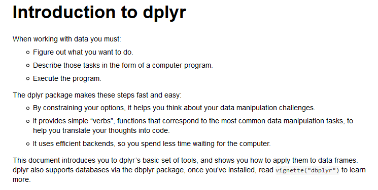</img>


# *DBI* | Importer depuis une base de données  {.flexbox .vcenter}

</img>


## Pré-requis

```{r, message = FALSE}
library(DBI)
```
```{r, message = FALSE}
library(odbc)
```
```{r, eval = FALSE}
tidyverse_conflicts()
```


## Démarrer PostgreSQL

* Lancer PostgreSQL via le raccourci "SQL Shell (psql)".

* Laisser les valeurs par défaut.

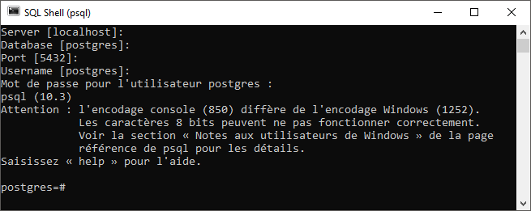</img>


## Démarrer PostgreSQL

Pour retirer le message d'avertissement, ajouter "chcp 1252" dans le fichier ".bat".

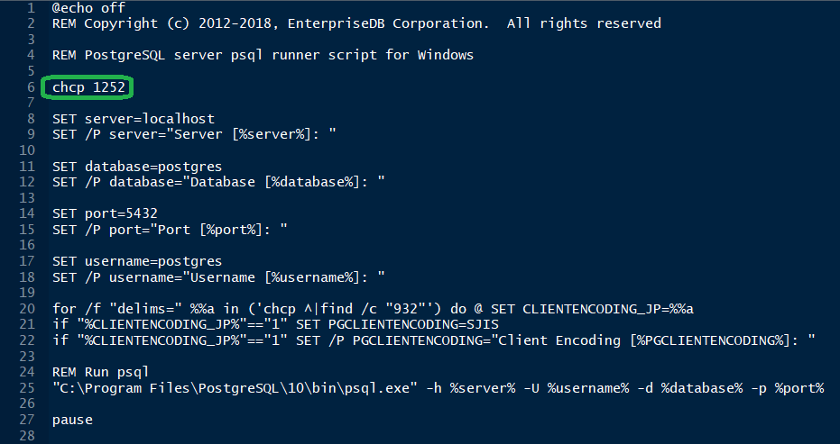</img>


## Commandes psql

* `\?` pour l'aide des commandes psql.
* `\q` quitter.
* `\h` aide des commandes sql.
* `\l` liste des bases de données.
* `\c` se connecter à une base.
* `\d` [nom] pour la description d'une table, d'un index, séquence, vue.
* `\d` liste des relations (tables, vues et séquences).
* `\i` nom_fichier.sql exécuter un fichier de commandes SQL.


## Base, utilisateur et droits en SQL

* Créer un utilisateur.
    ```{sql, eval = FALSE}
    CREATE ROLE test_user LOGIN password 'test_pwds';
    ```

* Créer une base.
    ```{sql, eval = FALSE}
    CREATE DATABASE test_data;
    ```

* Modifier le propriétaire d'une base.
    ```{sql, eval = FALSE}
    ALTER DATABASE test_data OWNER TO 'test_user';
    ```


## Base, utilisateur et droits en R

Des connecteurs :

* [RMySQL](https://github.com/rstats-db/RMySQL#readme): MySQL et MariaDB.
* [RPostgreSQL](https://cran.r-project.org/package=RPostgreSQL): Postgres et Redshift.
* [RSQLite](https://github.com/rstats-db/RSQLite): base de données SQLite intégrée.
* [odbc](https://github.com/rstats-db/odbc#odbc): protocoles de connection libre.
* [bigrquery](https://github.com/rstats-db/bigrquery): Google BigQuery.


## Base, utilisateur et droits en R

* Identifier le pilote de connection.
    ```{r}
    odbcListDrivers() %>% 
      filter(attribute=="Description") %>% 
      select(-attribute)
    ```


## Base, utilisateur et droits en R

* Initier la connection.
    ```{r}
    con <- dbConnect(
      drv = odbc(),
      driver = "PostgreSQL Unicode",
      server = "localhost",
      port = 5432,
      database = "postgres",
      uid = "postgres",
    ### <b>
      password = "password"
    ### </b>
    )
    ```
    ```{r, eval = FALSE}
    con <- dbConnect(
      drv = odbc(),
      driver = "PostgreSQL Unicode",
      server = "localhost",
      port = 5432,
      database = "postgres",
      uid = "postgres",
    ### <b>
      password = rstudioapi::askForPassword("Mot de passe :")
    ### </b>
    )
    ```


## Base, utilisateur et droits en R

* Créer un utilisateur.
    ```{r}
    dbSendQuery(con, SQL("CREATE ROLE test_user LOGIN password 'test_pwd';"))
    ```
* Créer une base.
    ```{r}
    dbSendQuery(con, SQL("CREATE DATABASE test_data;"))
    ```


## Base, utilisateur et droits en R

* Modifier le propriétaire d'une base.
    ```{r}
    dbSendQuery(con, SQL("ALTER DATABASE test_data OWNER TO test_user;"))
    ```


## Base, utilisateur et droits en R

* Se déconnecter de la base.
    ```{r}
    dbDisconnect(con)
    ```

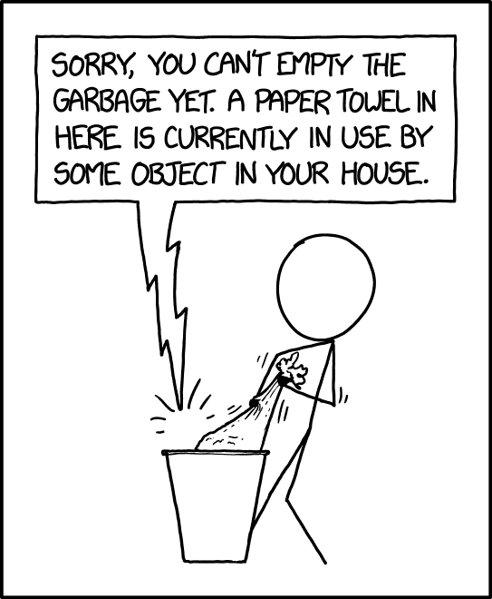</img>


## Créer des tables en SQL depuis R

* Se connecter en tant que "test_user".
    ```{r}
    con <- dbConnect(
      drv = odbc(),
      driver = "PostgreSQL Unicode",
      server = "localhost",
      database = "test_data",
      port = 5432,
    ### <b>
      uid = "test_user",
      password = "test_pwd"
    ### </b>
    )
    ```


## Créer des tables en SQL depuis R

* Lister les tables.
    ```{r}
    dbListTables(con)
    ```

* Créer une table "mtcars".
    ```{r}
    mtcars %>% 
      rownames_to_column(var = "car") %>% 
      mutate(const = gsub(" .*", "", car)) %>% 
      select(const, everything()) %>% 
      ### <b>
      dbWriteTable(con, "mtcars", .)
      ### </b>
    ```

* Lister les tables.
    ```{r}
    dbListTables(con)
    ```
    

## Faire des requêtes en SQL depuis R

* Lister les champs d'une table.
    ```{r}
    dbListFields(con, "mtcars")
    ```

* Lire une table.
    ```{r, echo = FALSE}
    options(tibble.print_max = 5, tibble.print_min = 5)
    ```
    ```{r}
    ### <b>
    dbReadTable(con, "mtcars") %>% 
    ### </b>
      as_tibble()
    ```


## Faire des requêtes en SQL depuis R

```{r, echo = FALSE}
options(tibble.print_max = 10, tibble.print_min = 10)
```

* Extraire des données.
    ```{r}
    res <- dbSendQuery(con, "SELECT * FROM mtcars WHERE const='Merc'")
    dbFetch(res)
    ```

* Libérer les ressources occupées par la requête.
    ```{r, message = FALSE}
    ### <b>
    dbClearResult(res)
    ### </b>
    dbDisconnect(con)
    ```


## Exercices {#exe}

* En tant qu'utilisateur "postgres" :
    * Créez une base "datawarehouse".  
    * Créez un utilisateur "data_user".  
    * Changez le propriétaire de "datawarehouse" par "data_user".
    
* En tant qu'utilisateur "data_user", exportez le fichier "ratings.csv" vers la base.
    Remplacez les espaces par des underscores dans les noms de colonnes.
    
* Listez les noms de colonnes de la table créée.

* Utilisez une requête SQL pour compter le nombre de films pour chaque note ("Your Rating").  
    Importez le résultat localement sous la forme d'un `tibble`.
    
* Sélectionnez les films notés entre le 1<sup>er</sup> janvier 2017 et le 31 décembre 2017.  
    Exportez cette table vers la base de données.


## Exercices {#exe}

* En tant qu'utilisateur "postgres" :
    * Créez une base "datawarehouse".  
    * Créez un utilisateur "data_user".  
    * Changez le propriétaire de "datawarehouse" par "data_user".
    ```{r, warning = FALSE, message = FALSE, results = "hide"}
    con <- dbConnect(
      drv = odbc(),
      driver = "PostgreSQL Unicode",
      server = "localhost",
      database = "postgres",
      port = 5432,
      uid = "postgres",
      password = "password"
    )
    dbSendQuery(con, SQL("CREATE ROLE data_user LOGIN password 'data_pwd';"))
    dbSendQuery(con, SQL("CREATE DATABASE datawarehouse;"))
    dbSendQuery(con, SQL("ALTER DATABASE datawarehouse OWNER TO data_user;"))
    dbDisconnect(con)
    ```


## Exercices {#exe}

* En tant qu'utilisateur "data_user", exportez le fichier "ratings.csv" vers la base.
    Enlevez les espaces dans les noms de colonnes.
    ```{r, warning = FALSE, message = FALSE, results = "hide"}
    ratings <- read_csv(file = "./materials/ratings.csv", locale = locale(encoding = )) %>% 
      `colnames<-`(gsub(" ", "", colnames(.)))
    ```
    ```{r, warning = FALSE, message = FALSE, results = "hide"}
    con <- dbConnect(
      drv = odbc(),
      driver = "PostgreSQL Unicode",
      server = "localhost",
      database = "datawarehouse",
      port = 5432,
      uid = "data_user",
      password = "data_pwd"
    )
    dbWriteTable(con, "ratings", ratings)
    ```


## Exercices {#exe}

* Listez les noms de colonnes de la table créée.
    ```{r, warning = FALSE, message = FALSE, results = "hide"}
    dbListFields(con, 'ratings')
    ```


## Exercices {#exe}

* Utilisez une requête SQL pour compter le nombre de films pour chaque note ("YourRating").  
    Importez le résultat localement sous la forme d'un `tibble`.
    ```{r, warning = FALSE, message = FALSE, results = "hide"}
    dbSendQuery(
      conn = con, 
      statement = SQL(
        'SELECT "YourRating", COUNT(*) as count FROM ratings GROUP BY "YourRating";'
      )
    ) %>% 
      dbFetch() %>% 
      as_tibble()
    ```


## Exercices {#exe}
* Sélectionnez les films notés entre le 1<sup>er</sup> janvier 2017 et le 31 décembre 2017.  
    Exportez cette table vers la base de données.
    ```{r, warning = FALSE, message = FALSE, results = "hide"}
    dbSendQuery(
      conn = con, 
      statement = SQL(
        'SELECT * 
          FROM ratings 
          WHERE "DateRated">=\'2017-01-01\' AND "DateRated"<=\'2017-12-31\';'
      )
    ) %>% 
      dbFetch() %>% 
      dbWriteTable(con, "ratings2017", .)
    
    dbListTables(con)
    ```
```{r, echo = FALSE, warning = FALSE, message = FALSE, results = "hide"}
dbDisconnect(con)
```


## Pour aller plus loin ...

Liste de diffusion autour du package *DBI*: [r-sig-db](https://stat.ethz.ch/mailman/listinfo/r-sig-db).

```{r, eval = FALSE}
vignette(package = "DBI")
```

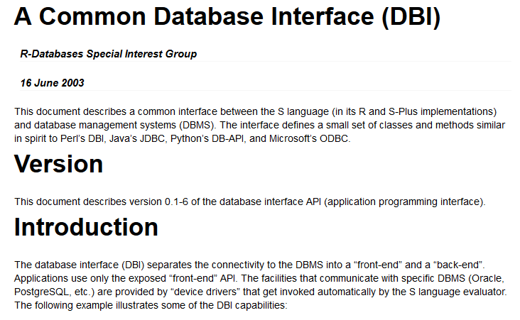</img>


# *dplyr* & *dbplyr* | Une grammaire SQL généralisée {.flexbox .vcenter}

</img>


## Pré-requis

```{r, echo = FALSE}
options(tibble.print_max = 4, tibble.print_min = 4)
```
```{r, message = FALSE}
library(DBI)
```
```{r, message = FALSE}
library(odbc)
```
```{r, message = FALSE}
library(tidyverse)
```
```{r, message = FALSE}
library(dbplyr)
```
```{r, eval = FALSE}
tidyverse_conflicts()
```


## *dbplyr* : Premiers pas avec *dplyr*

* Connection sur une base de données SQL intégrée (package *RSQLite*).
    ```{r, eval = FALSE}
    con <- dbConnect(RSQLite::SQLite(), path = ":memory:")
    ```

* Connection à la base PostgreSQL.
    ```{r}
    con <- dbConnect(
      drv = odbc(),
      driver = "PostgreSQL Unicode",
      server = "localhost",
      database = "datawarehouse",
      port = 5432,
      uid = "data_user",
      password = "data_pwd"
    )
    ```


## *dbplyr* : Premiers pas avec *dplyr*

* Remplir la base.
    ```{r, message = FALSE}
    ratings <- read_csv(file = "./materials/ratings.csv") %>% 
      `colnames<-`(gsub(" ", "", colnames(.))) %>% 
      mutate(Year = lubridate::year(DateRated))
    ```
    ```{r, message = FALSE}
    copy_to(
      dest = con, 
      df = ratings, 
      name = "ratings_idx",
      temporary = FALSE, 
      indexes = list(
        "DateRated", 
        "YourRating", 
        "Title", 
        "Year"
      ),
      overwrite = TRUE
    )
    ```

__Note :__ `temporary = TRUE` permet de rendre la table uniquement disponible à la connection en cours et uniquement pendant celle-ci.


## *dbplyr* : Premiers pas avec *dplyr*

* Faire une référence à une table depuis une connection.
    ```{r}
    ratings_db <- tbl(con, "ratings")
    class(ratings_db)
    ```

* Afficher l'objet.
    ```{r}
    ratings_db
    ```

## Manipuler une base avec *dplyr*

* Faire des requêtes sans SQL.
    ```{r}
    date_sevendaysago <- (Sys.Date()-7)
    
    ratings_db %>% 
      filter(DateRated > date_sevendaysago) %>% 
      select(Title, DateRated, YourRating, IMDbRating)
    ```


## Manipuler une base avec *dplyr*

* Faire des opérations en SQL sans SQL.
    ```{r}
    ratings_db %>% 
      group_by(Year) %>% 
      summarise(
        N = n(),
        AvgRating = mean(YourRating)
      ) %>% 
      arrange(Year)
    ```


## Manipuler une base avec *dplyr*

* *dplyr* et `tbl_df`.
    ```{r}
    ratings_summary <- ratings %>% 
      group_by(Year) %>% 
      summarise(
        N = n(),
        AvgRating = mean(YourRating)
      ) %>% 
      arrange(Year)
    ```
    ```{r}
    str(ratings_summary, 1)
    ```


## Manipuler une base avec *dplyr*

* *dplyr* et `tbl_sql`.
    ```{r}
    ratings_summary_db <- ratings_db %>% 
      group_by(Year) %>% 
      summarise(
        N = n(),
        AvgRating = mean(YourRating)
      ) %>% 
      arrange(Year)
    ```
    ```{r}
    str(ratings_summary_db, 1)
    ```


## Manipuler une base avec *dplyr*

* L'envoi de la requête ne s'effectue qu'à la fin ou à l'affichage de l'objet.
    ```{r}
    ratings_summary_db %>% 
      print()
    ```


## Manipuler une base avec *dplyr*

* Les données ne sont jamais téléchargées dans R (sauf mention explicite).
    ```{r}
    ratings_summary_db %>% 
      collect()
    ```


## Retour au SQL avec *dplyr*

* Que fait *dplyr* pour effectuer la commande précédente `ratings_summary_db` ?
    ```{r}
     ratings_summary_db %>% 
      show_query()
    ```
    
* Traduire du R en requête SQL.
    ```{r}
    translate_sql(head(ratings_db))
    ```


## Exercices {#exe}

* Comment *dbplyr* traduit les fonctions `as.numeric()` et `as.character()` ?

* Comment *dbplyr* traduit l'opérateur `^` ?

* Comment *dbplyr* traduit les fonctions `mean()`et `sd()` ?  
    Et avec `trim = 0.05` ou `na.rm = TRUE` ?


## Exercices {#exe}

* Comment *dbplyr* traduit les fonctions `as.numeric()` et `as.character()` ?
    ```{r}
    translate_sql(as.numeric(x))
    ```
    ```{r}
    translate_sql(as.character(x))
    ```


## Exercices {#exe}

* Comment *dbplyr* traduit l'opérateur `^` ?
    ```{r}
    translate_sql(x^2)
    ```
    ```{r}
    tbl(con, sql('select 1 as x')) %>%
      mutate(sqr = x^2)
    ```


## Exercices {#exe}

* Comment *dbplyr* traduit les fonctions `mean()`et `sd()` ?  
    Et avec `trim = 0.05` ou `na.rm = TRUE` ?
    ```{r}
    translate_sql(mean(x))
    ```
    ```{r, error = TRUE}
    translate_sql(mean(x, trim = 0.05))
    ```
    ```{r}
    translate_sql(mean(x, na.rm = TRUE))
    ```
    

## *dplyr* > SQL > ~~*tbl* ?~~ > `collect()` > *tbl* 

* Rappatrier les données d'une requête via `collect()`
    ```{r}
    ratings_summary <- ratings_summary_db %>% 
      collect()
    class(ratings_summary)
    ```


## Exercices {#exe}

* Utilisez les fonctions `head()` , `tail()` et `nrow()` sur `ratings_summary_db`.  
    Que se passe-t'il et pourquoi ?


## Exercices {#exe}

* Utilisez les fonctions `head()` , `tail()` et `nrow()` sur `ratings_summary_db`.  
    Que se passe-t'il et pourquoi ?
    ```{r, warning = FALSE}
    ratings_summary_db %>% head(1)
    ```
    ```{r, error = TRUE}
    ratings_summary_db %>% tail()
    ```
    ```{r, error = TRUE}
    ratings_summary_db %>% nrow()
    ```


## *dplyr* > SQL > ~~*tbl* ?~~ > `collect()` > *tbl* 

* Connaître les dimensions de l'objet avant `collect()` ?
    ```{r}
    tally(ratings_summary_db)
    ```


## *dplyr*, `explain()` to me

```{r}
explain(ratings_summary_db)
```

```{r, echo = FALSE, warning = FALSE, message = FALSE}
rm(ratings_db, ratings_summary_db)
dbDisconnect(con)
```

## Une base de données relationnelle

* Schéma "partiel" des tables du package *nycflights13*.

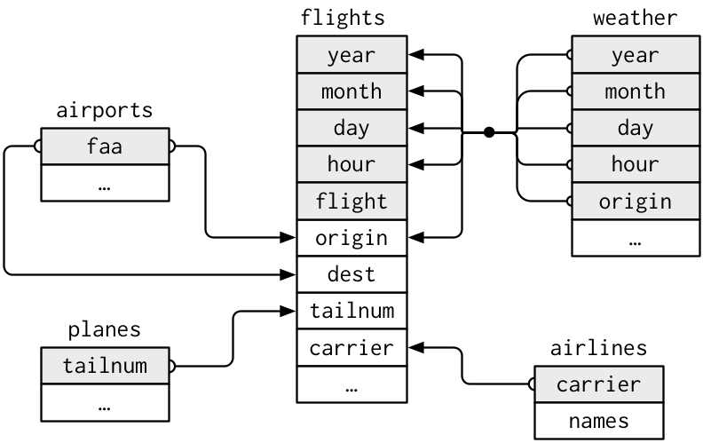</img>


## Exercices (Partie I) {#exe}

```{r, echo = FALSE}
options(tibble.print_max = 10, tibble.print_min = 10)
```

* Connectez vous à la base "datawarehouse" en tant que "data_user".

* Créez une table "mtcars" avec le jeu de données `mtcars`.  
    Comparez les fonctions `dplyr::copy_to()` (en utilisant l'argument `temporary`) et `DBI::dbWriteTable()`.
    
* Modifiez `mtcars` en passant les noms de lignes dans une colonne 
et en ajoutant une colonne constructeur "const".  
    Exporter l'objet `mtcars` vers la base.  
    Que se passe-t'il ? (argument `overwrite`).

* Créez dans la base "datawarehouse" l'ensemble des tables de *nycflights13*.  
    Vérifiez que les tables sont bien créées.
    
* Effectuez la jointure des tables `planes` et `flights` pour identifier les trois constructeurs ayant le plus grand nombre d'heures de vol (`?dplyr::join`).  
    Quelle est la requête SQL réalisée ?


## Exercices (Partie I) {#exe}

* Connectez vous à la base "datawarehouse" en tant que "data_user".
    ```{r}
    con <- dbConnect(
      drv = odbc(),
      driver = "PostgreSQL Unicode",
      server = "localhost",
      database = "datawarehouse",
      port = 5432,
      uid = "data_user",
      password = "data_pwd"
    )
    ```

## Exercices (Partie I) {#exe}

* Créez une table "mtcars" avec le jeu de données `mtcars`.  
    Comparez les fonctions `dplyr::copy_to()` (en utilisant l'argument `temporary`) et `DBI::dbWriteTable()`.
    ```{r}
    copy_to(con, mtcars, "mtcars", temporary = TRUE, overwrite = TRUE)
    dbListTables(con)
    ```
    ```{r}
    copy_to(con, mtcars, "mtcars", temporary = FALSE, overwrite = TRUE)
    dbListTables(con)
    ```
    ```{r}
    dbWriteTable(con, "mtcars", mtcars, overwrite = TRUE)
    dbListTables(con)
    ```
    
    
## Exercices (Partie I) {#exe}

* Modifiez `mtcars` en passant les noms de lignes dans une colonne 
et en ajoutant une colonne constructeur "const".  
    Exporter l'objet `mtcars` vers la base.  
    Que se passe-t'il ? (argument `overwrite`).
    ```{r}
    mtcars %>% 
      rownames_to_column(var = "car") %>% 
      mutate(const = gsub(" .*", "", car)) %>% 
      select(const, everything()) %>% 
      dbWriteTable(con, "mtcars", ., overwrite = TRUE)
    ```


## Exercices (Partie I) {#exe}

* Créez dans la base "datawarehouse" l'ensemble des tables de *nycflights13*.  
    Vérifiez que les tables sont bien créées.
    ```{r, eval = FALSE}
    library(nycflights13)
    dbWriteTable(con, "flights", flights)
    dbWriteTable(con, "airports", airports)
    dbWriteTable(con, "planes", planes)
    dbWriteTable(con, "weather", weather)
    dbWriteTable(con, "airlines", airlines)
    
    dbListTables(con)
    ```


## Exercices (Partie I) {#exe}

* Créez dans la base "datawarehouse" l'ensemble des tables de *nycflights13*.  
    Vérifiez que les tables sont bien créées.
    ```{r}
    library(nycflights13)
    nycflights13_db <- ls("package:nycflights13") %>% 
      lapply(., function(df) { 
        copy_to(
          df = get(df), 
          dest = con, 
          name = df, 
          overwrite = TRUE, 
          temporary = TRUE
        ) 
      }) %>% 
      `names<-`(ls("package:nycflights13"))
    ```
    ```{r}
    dbListTables(con)
    ```


## Exercices (Partie I) {#exe}

* Effectuez la jointure des tables `planes` et `flights` pour identifier les trois constructeurs ayant le plus grand nombre d'heures de vol (`?dplyr::join`).
    ```{r, warning = FALSE}
    longest_air_time_db <- nycflights13_db[["flights"]] %>%
      inner_join(nycflights13_db[["planes"]], by = "tailnum") %>%
      group_by(manufacturer) %>% 
      summarise(total_air_time = sum(air_time)/60) %>% 
      arrange(desc(total_air_time)) %>%
      select(manufacturer, total_air_time) %>% 
      head(3)
    longest_air_time_db
    ```


## Exercices (Partie I) {#exe}

* Effectuez la jointure des tables `planes` et `flights` pour identifier les trois constructeurs ayant le plus grand nombre d'heures de vol (`?dplyr::join`).  
    Quelle est la requête SQL réalisée ?
    ```{r, warning = FALSE}
    longest_air_time_db %>% show_query()
    ```

## Exercices (Partie II) {#exe}

```{r, echo = FALSE}
options(tibble.print_max = 3, tibble.print_min = 3)
```

* Calculez la moyenne des températures "temp" (table `weather`) par station "origin" et par année "year".  
    Comparez le résultat de la version locale (`tbl_df`) et distante (`tbl_sql`).

* Comptez le nombre d'aéroport dont le code "dest" (table `flights`) commence par la lettre "A" ([Wildcard SQL](https://www.w3schools.com/sql/sql_wildcards.asp); `%like%`).

* Créez une nouvelle colonne "origin_dest" à partir de "origin" et "dest".


## Exercices (Partie II) {#exe}

* Calculez la moyenne des températures "temp" (table `weather`) par station "origin" et par année "year".  
    Comparez le résultat de la version locale (`tbl_df`) et distante (`tbl_sql`).
    ```{r}
    nycflights13::weather %>% 
      group_by(origin, year) %>%  
      summarise(avg_temp = mean(temp))
    ```
    ```{r, warning = FALSE, eval= FALSE}
    nycflights13_db[["weather"]] %>% 
      group_by(origin, year) %>% 
      summarise(avg_temp = mean(temp))
    ```


## Exercices (Partie II) {#exe}

* Calculez la moyenne des températures "temp" (table `weather`) par station "origin" et par année "year".  
    Comparez le résultat de la version locale (`tbl_df`) et distante (`tbl_sql`).
    ```{r, eval = FALSE}
    nycflights13::weather %>% 
      group_by(origin, year) %>%  
      summarise(avg_temp = mean(temp))
    ```
    ```{r, warning = FALSE}
    nycflights13_db[["weather"]] %>% 
      group_by(origin, year) %>% 
      summarise(avg_temp = mean(temp))
    ```


## Exercices (Partie II) {#exe}

* Comptez le nombre d'aéroport dont le code "dest" (table `flights`) commence par la lettre "A" ([Wildcard SQL](https://www.w3schools.com/sql/sql_wildcards.asp); `%like%`).
    ```{r}
    nycflights13_db[["flights"]] %>% 
      filter(dest %like% 'A%') %>% 
      summarise(count = n_distinct(dest))
    ```


## Exercices (Partie II) {#exe}

```{r, echo = FALSE}
options(tibble.print_max = 2, tibble.print_min = 2)
```

* Créez une nouvelle colonne "origin_dest" à partir de "origin" et "dest".
    ```{r}
    nycflights13_db[["flights"]] %>%
      mutate(origin_dest = origin %|| '-' ||% dest) %>%
      select(origin, dest, origin_dest)
    ```
    ```{r, eval = FALSE}
    nycflights13_db[["flights"]] %>%
      mutate(origin_dest = CONCAT(origin, "-", dest)) %>%
      select(origin, dest, origin_dest)
    ```
    ```{r, eval = FALSE}
    nycflights13_db[["flights"]] %>%
      mutate(origin_dest = paste(origin, dest, sep = "-")) %>%
      select(origin, dest, origin_dest)
    ```


## Exercices (Partie II) {#exe}

* Créez une nouvelle colonne "origin_dest" à partir de "origin" et "dest".
    ```{r, eval = FALSE}
    nycflights13_db[["flights"]] %>%
      mutate(origin_dest = origin %|| '-' ||% dest) %>%
      select(origin, dest, origin_dest)
    ```
    ```{r}
    nycflights13_db[["flights"]] %>%
      mutate(origin_dest = CONCAT(origin, "-", dest)) %>%
      select(origin, dest, origin_dest)
    ```
    ```{r, eval = FALSE}
    nycflights13_db[["flights"]] %>%
      mutate(origin_dest = paste(origin, dest, sep = "-")) %>%
      select(origin, dest, origin_dest)
    ```


## Exercices (Partie II) {#exe}

* Créez une nouvelle colonne "origin_dest" à partir de "origin" et "dest".
    ```{r, eval = FALSE}
    nycflights13_db[["flights"]] %>%
      mutate(origin_dest = origin %|| '-' ||% dest) %>%
      select(origin, dest, origin_dest)
    ```
    ```{r, eval = FALSE}
    nycflights13_db[["flights"]] %>%
      mutate(origin_dest = CONCAT(origin, "-", dest)) %>%
      select(origin, dest, origin_dest)
    ```
    ```{r}
    nycflights13_db[["flights"]] %>%
      mutate(origin_dest = paste(origin, dest, sep = "-")) %>%
      select(origin, dest, origin_dest)
    ```
 
```{r, echo = FALSE, results = "hide"}
dbDisconnect(con)
```
    

## Schéma et table

* Une base de données contenant des schémas décrivant des tables.
    ```{r, echo = FALSE}
    con <- dbConnect(
      drv = odbc(),
      driver = "PostgreSQL Unicode",
      server = "localhost",
      database = "datawarehouse",
      port = 5432,
      uid = "data_user",
      password = "data_pwd"
    )
    ```
    ```{r, eval = FALSE, message = FALSE, warning = FALSE}
    ### <b>
    dbSendQuery(con, 'CREATE SCHEMA nycflights13;')
    ### </b>
    dbWriteTable(con, SQL("nycflights13.flights"), flights)
    ```
    ```{r, eval = FALSE, echo = FALSE}
    dbWriteTable(con, SQL("nycflights13.airports"), airports)
    dbWriteTable(con, SQL("nycflights13.planes"), planes)
    dbWriteTable(con, SQL("nycflights13.weather"), weather)
    dbWriteTable(con, SQL("nycflights13.airlines"), airlines)
    ```
    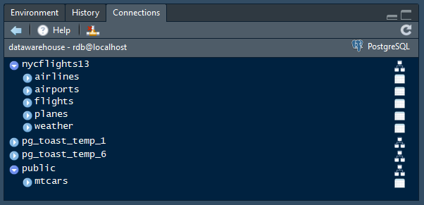</img>


## Schéma et table

```{r, echo = FALSE}
options(tibble.print_max = 5, tibble.print_min = 5)
```

* La fonction `tbl()` cherche dans le schéma par défaut ("public" sur PostgreSQL).
    ```{r}
    tbl(con, "mtcars") %>% head()
    ```


## Schéma et table

* `dplyr::ìn_schema()` permet de spécifier le schéma à utiliser.
    ```{r}
    tbl(con, in_schema("public", "mtcars")) %>% head()
    ```


## Schéma et table

* Accéder à une table présente dans un schéma autre que celui par défaut.
    ```{r, eval = FALSE}
    tbl(con, in_schema("nycflights13", "flights")) %>% head(1)
    ```
    ```{r, eval = FALSE}
    tbl(con, in_schema("nycflights13", "weather")) %>% head(1)
    ```
    
```{r, echo = FALSE, results = "hide"}
dbDisconnect(con)
```


## Pour aller plus loin ...

* Tutoriel SQL : [www.codecademy.com](https://www.codecademy.com/learn/learn-sql)

* Le SQL en 10 étapes : [blog.jooq.org](https://blog.jooq.org/2016/03/17/10-easy-steps-to-a-complete-understanding-of-sql/)

* "Databases using R" : [db.rstudio.com](http://db.rstudio.com)


# *rvest* | Extraction de contenus web {.flexbox .vcenter}

</img>


## Protocole HTTP et Web {.flexbox .vcenter}

</img>


## Protocole HTTP et Web {.flexbox .vcenter}

</img>


## Protocole HTTP et Web {.flexbox .vcenter}

</img>


## La page de l'IMDb {.flexbox .vcenter}

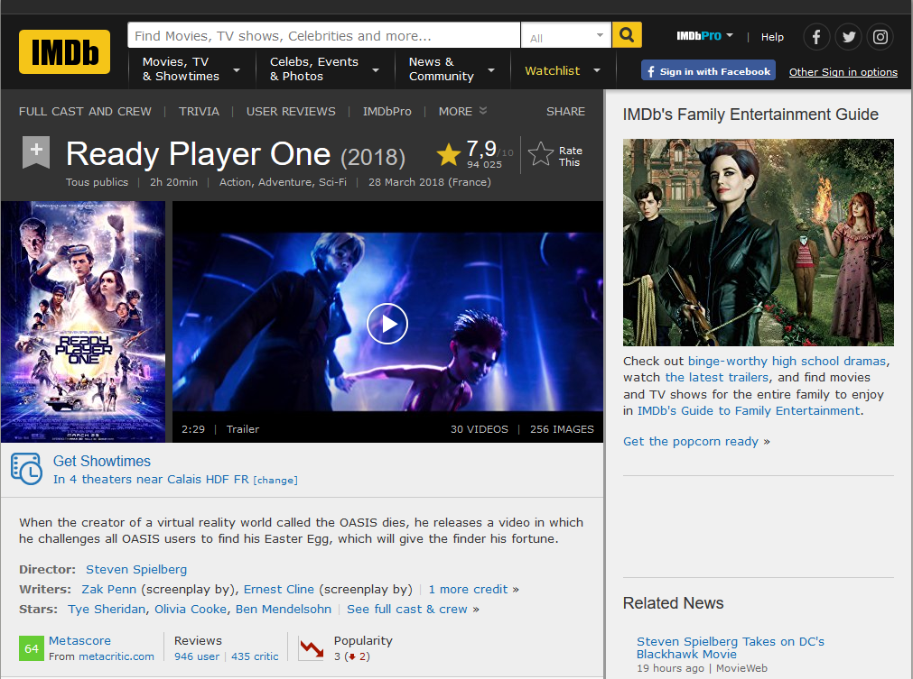</img>


## Stratégie {.flexbox .vcenter}

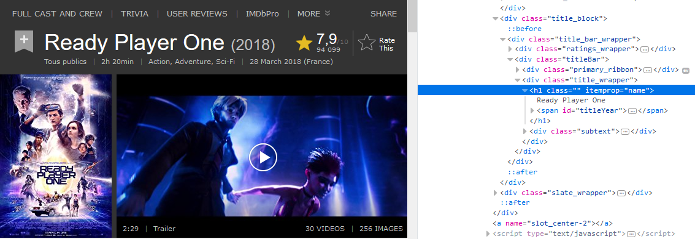</img>


## Stratégie 

* Identifier les balises HTML encapsulant l'information.
* Utiliser l'architecture en arbre du code HTML.

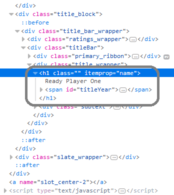</img>


## Stratégie 

* Identifier les balises HTML encapsulant l'information.
* Utiliser l'architecture en arbre du code HTML et du CSS.

<div class="columns-2">
</img>

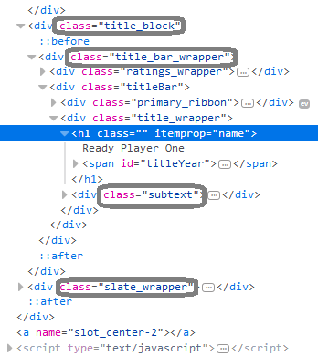</img>
</div>


## Pré-requis

```{r, echo = FALSE}
options(tibble.print_max = 5, tibble.print_min = 5)
```
```{r, message = FALSE}
library(xml2)
library(rvest)
library(DBI)
library(odbc)
```
```{r, message = FALSE}
library(tidyverse)
```
```{r, eval = FALSE}
tidyverse_conflicts()
```


## *rvest* : Les étapes clés

1. Télécharger le code HTML et le convertir en XML.
    ```{r, eval = FALSE}
    read_html()
    ```
2. Extraire les noeuds.
    ```{r, eval = FALSE}
    html_nodes()
    ```
3. Extraire le contenu des noeuds.
    * `html_text()`
    * `html_name()`
    * `html_attrs()`
    * `html_children()`
    * `html_table()`
    ```{r, eval = FALSE}
    imdb_xml %>% 
      html_nodes("h1") %>% 
      html_text()
    ```

## *rvest* : Les étapes clés

* Récupérer l'URL de la page casting du film.
    ```{r}
    rpo_cast_url <- "https://www.imdb.com/title/tt1677720/fullcredits/"
    ```

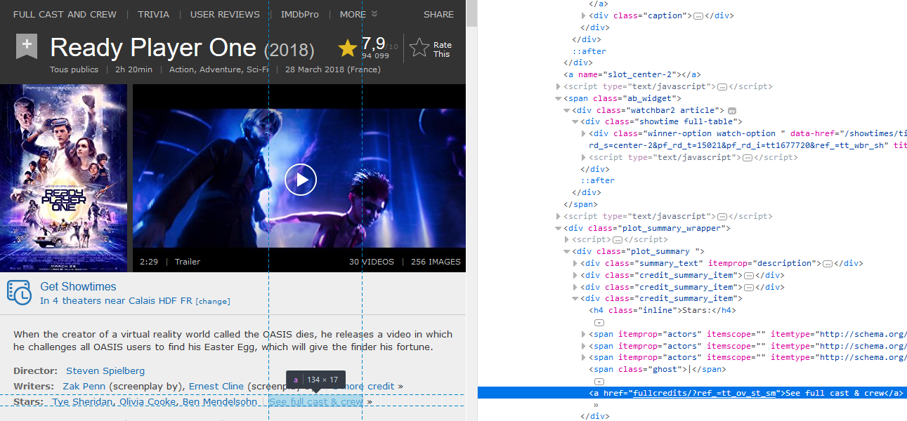</img>


## *rvest* : Les étapes clés

* Récupérer la table contenant les acteurs et les personnages du film.
    ```{r}
    rpo_cast_list <- read_html(rpo_cast_url) %>% 
      html_nodes("table.cast_list")
    ```

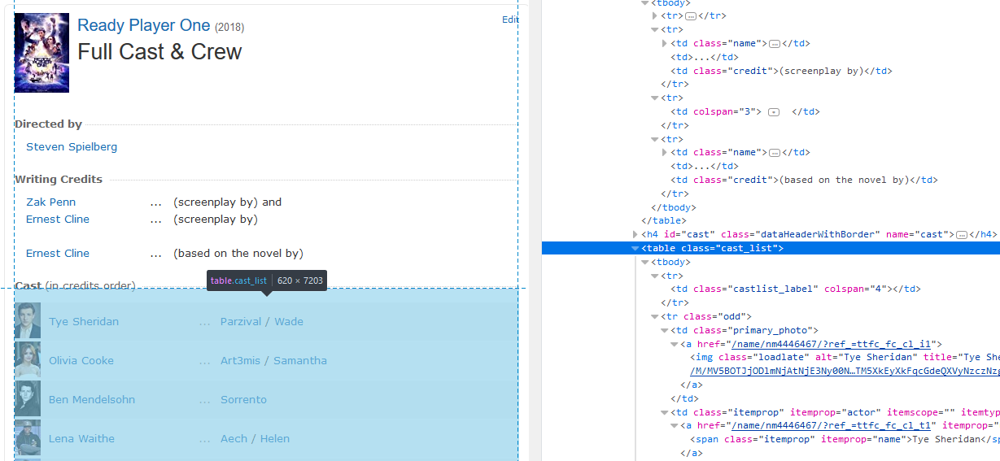</img>


## *rvest* : Exemple avec l'IMDb

* Récupérer la liste des personnages du film.
    ```{r}
    rpo_character_list <- rpo_cast_list %>% 
      html_nodes("td.character")
    ```

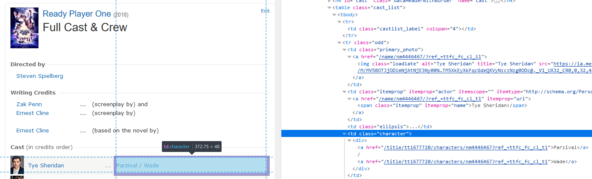</img>


## *rvest* : Exemple avec l'IMDb

* Extraire le contenu des noeuds.
    ```{r}
    html_text(rpo_character_list) %>% head(2)
    ```
* Formater le contenu.
    ```{r}
    rpo_character_list %>% 
      html_text() %>% 
      gsub("\n", "", .) %>% 
      gsub(" +", " ", .) %>% 
      gsub("^ (.*) $", "\\1", .) %>% 
      head(2)
    ```


## *rvest* : Exemple avec l'IMDb

* Reconstruction du tableau acteur/personnage.
    ```{r}
    cast_tbl <- rpo_cast_list %>% 
      html_table() %>% 
      .[[1]] %>% 
      select(2, 4) %>% 
      as_tibble() %>% 
      rename(Actor = X2, Character = X4) %>% 
      mutate(
        Character = Character %>% 
        gsub("\n", "", .) %>% 
        gsub(" +", " ", .) %>% 
        gsub("^ (.*) $", "\\1", .)
      ) %>% 
      filter(!grepl("Rest of cast listed alphabetically:", Actor)) %>% 
      filter(Actor!="")
    
    head(cast_tbl, 3)
    ```


## *rvest*, *DBI*, *dplyr*, *dbplyr* et le *tidyverse*

* Lecture du fichier contenant les notes des films.
    ```{r, results = "hide", message = FALSE}
    ratings <- read_csv("materials/ratings.csv") %>% 
      `colnames<-`(gsub(" ", "", colnames(.))) %>% 
      mutate(
        Year = lubridate::year(DateRated),
        Month = lubridate::month(DateRated),
        Day = lubridate::wday(DateRated)
      )
    ```


## *rvest*, *DBI*, *dplyr*, *dbplyr* et le *tidyverse*

* Création d'un nouveau utilisateur et d'une nouvelle base.
    ```{r, results = "hide", warning = FALSE}
    con <- dbConnect(
      drv = odbc(),
      driver = "PostgreSQL Unicode",
      server = "localhost",
      database = "postgres",
      port = 5432,
      uid = "postgres",
      password = "password"
    )
    dbSendQuery(con, SQL("CREATE ROLE imdb_user LOGIN password 'imdb_pwd';"))
    dbSendQuery(con, SQL("CREATE DATABASE movies;"))
    dbSendQuery(con, SQL("ALTER DATABASE movies OWNER TO imdb_user;"))
    dbDisconnect(con)
    ```


## *rvest*, *DBI*, *dplyr*, *dbplyr* et le *tidyverse*

* Connection avec "imdb_user" sur "movies".
    ```{r, results = "hide"}
    con <- dbConnect(
      drv = odbc(),
      driver = "PostgreSQL Unicode",
      server = "localhost",
      database = "movies",
      port = 5432,
      uid = "imdb_user",
      password = "imdb_pwd"
    )
    ```


## *rvest*, *DBI*, *dplyr*, *dbplyr* et le *tidyverse*

* Création de la table `ratings` (et d'un objet `tbl_sql`).
    ```{r, results = "hide"}
    ratings_db <- copy_to(
      dest = con, 
      df = ratings, 
      names = "ratings", 
      overwrite = TRUE,
      temporary = FALSE
    )
    ```


## *rvest*, *DBI*, *dplyr*, *dbplyr* et le *tidyverse*

* Extraction du casting d'un film provenant de la table `ratings`.
    ```{r, results = "hide"}
    cast_list <- ratings_db %>% 
      filter(Title %like% "Ready Player One") %>% 
      collect() %>% 
      .[["URL"]] %>% 
      paste0(., "fullcredits/") %>% 
      read_html() %>% 
      html_nodes("table.cast_list")
    ```


## *rvest*, *DBI*, *dplyr*, *dbplyr* et le *tidyverse*

* Création d'un tableau casting.
    ```{r, results = "hide"}
    cast_tbl <- rpo_cast_list %>% 
      html_table() %>% 
      .[[1]] %>% 
      select(2, 4) %>% 
      as_tibble() %>% 
      rename(Actor = X2, Character = X4) %>% 
      mutate(
        Character = Character %>% 
        gsub("\n", "", .) %>% 
        gsub(" +", " ", .) %>% 
        gsub("^ (.*) $", "\\1", .)
      ) %>% 
      filter(!grepl("Rest of cast listed alphabetically:", Actor)) %>% 
      filter(Actor!="")
    ```


## *rvest*, *DBI*, *dplyr*, *dbplyr* et le *tidyverse*

* Fontion de récupération du casting d'un film.
    ```{r}
    get_cast <- function(x) {
      x %>% 
        paste0(., "fullcredits/") %>% 
        read_html() %>% 
        html_nodes("table.cast_list") %>% 
        html_table() %>% 
        .[[1]] %>% 
        select(2, 4) %>% 
        as_tibble() %>% 
        rename(Actor = X2, Character = X4) %>% 
        mutate(
          Character = Character %>% 
          gsub("\n", "", .) %>% 
          gsub(" +", " ", .) %>% 
          gsub("^ (.*) $", "\\1", .)
        ) %>% 
        filter(!grepl("Rest of cast listed alphabetically:", Actor)) %>% 
        filter(Actor!="") %>% 
        mutate(url = x)
    }
    ```


## *rvest*, *DBI*, *dplyr*, *dbplyr* et le *tidyverse*

* Fontion de récupération du casting d'un film.
    ```{r}
    get_cast("https://www.imdb.com/title/tt0100240/")
    ```


## *rvest*, *DBI*, *dplyr*, *dbplyr* et le *tidyverse*

* Ajout du casting dans `ratings_db` (local).
    ```{r}
    casting <- ratings_db %>% 
      select(URL) %>% 
      collect() %>% 
      head() %>% 
      mutate(
        Casting = map(URL, get_cast)
      )
    casting
    ```


## Exercices {#exe}

En utilisant le lien url : https://www.imdb.com/user/ur56341222/ratings.

* Reconstituez une table contenant au minimum : le titre, le genre, la durée et la note ("étoile jaune").

* Compilez des statistiques (moyenne, écart-type, etc.) dans une nouvelle table.

* Exportez ces tables vers une base de données.
 

## Exercices {#exe}

* Reconstituez une table contenant au minimum : le titre, le genre, la durée et la note ("étoile jaune").
    ```{r, eval = FALSE}
    movies_list <- "https://www.imdb.com/user/ur56341222/ratings" %>% 
      read_html() %>% 
      html_nodes("div#ratings-container.lister-list") %>% 
      html_nodes("div.lister-item.mode-detail")
    ```
    * Titre.
    ```{r, eval = FALSE}
    title <- movies_list %>% 
      html_nodes("h3.lister-item-header") %>% 
      html_text() %>% 
      gsub("\n", "", .) %>% 
      gsub(" [0-9]+.", "", .) %>% 
      gsub(" +", " ", .) %>% 
      gsub("^ (.*) $", "\\1", .)
    ```

 
## Exercices {#exe}

* Reconstituez une table contenant au minimum : le titre, le genre, la durée et la note ("étoile jaune").
    ```{r, eval = FALSE}
    movies_list <- "https://www.imdb.com/user/ur56341222/ratings" %>% 
      read_html() %>% 
      html_nodes("div#ratings-container.lister-list") %>% 
      html_nodes("div.lister-item.mode-detail")
    ```
* Genres.
    ```{r, eval = FALSE}
    genres <- movies_list %>% 
      html_nodes("span.genre") %>% 
      html_text() %>% 
      gsub("\n", "", .) %>% 
      gsub(" +", " ", .) %>% 
      gsub("^ (.*) $", "\\1", .)
    ```   


## Exercices {#exe}

* Reconstituez une table contenant au minimum : le titre, le genre, la durée et la note ("étoile jaune").
    ```{r, eval = FALSE}
    movies_list <- "https://www.imdb.com/user/ur56341222/ratings" %>% 
      read_html() %>% 
      html_nodes("div#ratings-container.lister-list") %>% 
      html_nodes("div.lister-item.mode-detail")
    ```
* Durée du film.
    ```{r, eval = FALSE}
    runtime <- movies_list %>% 
      html_nodes("span.runtime") %>% 
      html_text() %>% 
      gsub("\n", "", .) %>% 
      gsub(" +", " ", .) %>% 
      gsub("^ (.*) $", "\\1", .)
    ```


## Exercices {#exe}

* Reconstituez une table contenant au minimum : le titre, le genre, la durée et la note ("étoile jaune").
    ```{r, eval = FALSE}
    movies_list <- "https://www.imdb.com/user/ur56341222/ratings" %>% 
      read_html() %>% 
      html_nodes("div#ratings-container.lister-list") %>% 
      html_nodes("div.lister-item.mode-detail")
    ```
* Note.
    ```{r, eval = FALSE}
    rating <- movies_list %>% 
      html_nodes("div.ipl-rating-widget") %>% 
      html_nodes("div.ipl-rating-star.small") %>% 
      html_text("span.ipl-rating-star__rating") %>% 
      unique() %>% 
      gsub("\n", "", .) %>% 
      gsub(" +", " ", .) %>% 
      gsub("^ (.*) $", "\\1", .) %>% 
      as.numeric() %>% 
      (function(.x) {if (length(.x)!=2) {c(NA, NA)} else {.x}})
    ```


## Exercices {#exe}

* Reconstituez une table contenant au minimum : le titre, le genre, la durée et la note ("étoile jaune").
    ```{r, eval = FALSE}
    get_movies_info <- function(x) {
      out <- c(
        x %>% html_nodes("h3.lister-item-header") %>% html_text() %>% gsub("\n", "", .) %>% 
          gsub(" [0-9]+.", "", .) %>% gsub(" +", " ", .) %>% gsub("^ (.*) $", "\\1", .),
      
        x %>% html_nodes("span.genre") %>% html_text() %>% 
          gsub("\n", "", .) %>% gsub(" +", " ", .) %>% gsub("^ (.*) $", "\\1", .),
    
        x %>% html_nodes("span.runtime") %>% html_text() %>% gsub("\n", "", .) %>% 
          gsub(" +", " ", .) %>% gsub("^ (.*) $", "\\1", .) %>% ifelse(length(.)==0, NA, .),
    
        x %>% html_nodes("div.ipl-rating-widget") %>% 
          html_nodes("div.ipl-rating-star.small") %>% 
          html_text("span.ipl-rating-star__rating") %>% 
          gsub("\n", "", .) %>% gsub(" +", " ", .) %>% gsub("^ (.*) $", "\\1", .) %>% 
          as.numeric() %>%(function(.x) {if (length(.x)!=2) {c(NA, NA)} else {.x}})
      )
      names(out) <- c("title", "genres", "runtime", "imdbrating", "userating")
      return(data.frame(t(as.matrix(out))))
    }
    ```


## Exercices {#exe}

* Reconstituez une table contenant au minimum : le titre, le genre, la durée et la note ("étoile jaune").
    ```{r, eval = FALSE}
    movies_list <- "https://www.imdb.com/user/ur56341222/ratings" %>% 
      read_html() %>% 
      html_nodes("div#ratings-container.lister-list") %>% 
      html_nodes("div.lister-item.mode-detail") %>% 
      map_df(.f = get_movies_info)
    ```


# *ggplot2* | The grammar of graphics {.flexbox .vcenter}

</img>


## Simplifier et améliorer les figures {.flexbox .vcenter}

</img>


## `ratings` en images

```{r, results = "hide", message = FALSE, warning = FALSE}
p <- read_csv("materials/ratings.csv") %>% 
  select(`Your Rating`, `IMDb Rating`) %>% 
  gather(data = ., key = Who, value = Rating) %>% 
  ggplot(aes(x = round(Rating, digits = 0), fill = Who)) +
    geom_density(
      aes(x = Rating, y = (..count../sum(..count..))*100),
      bw = 1, 
      alpha = 0.75, 
      colour = "white"
    ) +
    geom_histogram(
      aes(y = ..count../sum(..count..)),
      binwidth = 0.5,
      colour = "white",
      position = position_dodge2()
    ) +
    scale_x_continuous(name = "Rating", expand = c(0, 0), limits = c(0, 10), breaks = c(0, seq_len(10))) +
    scale_y_continuous(expand = expand_scale(mult = c(0, 0.05)), labels = percent) +
    scale_fill_viridis_d(name = NULL) +
    labs(x = "Rating", y = "Proportion", title = "Distribution of Ratings") +
    theme(legend.position = c(0, 1), legend.justification = c(-0.05, 1.05))
```


## `ratings` en images {.flexbox .vcenter}

```{r ratings_density, echo = FALSE, message = FALSE, warning = FALSE}
print(p)
```

## `ratings` en images {.flexbox .vcenter}

</img>


## `ratings` en images {.flexbox .vcenter}

```{r, eval = FALSE}
devtools::source_gist("https://gist.github.com/mcanouil/2bb6df3817b01049d4f2a4541de5e6de")
```
</img>


## `ratings` en images {.flexbox .vcenter}

</img>


## Pour aller plus loin ...

* *ggplot2* : [http://ggplot2.tidyverse.org/index.html](ggplot2.tidyverse.org)

* *dbplot* : [https://github.com/edgararuiz/dbplot](https://github.com/edgararuiz/dbplot)


# *nodbi* | Le connecteur pour les bases NoSQL {.flexbox .vcenter}

</img>


## *nodbi* (développement en cours)

Disponible sur GitHub : [nodbi](https://github.com/ropensci/nodbi)

Supporte :

* MongoDB
* Redis
* CouchDB
* Elasticsearch
* etcd
* Riak


## *nodbi* (développement en cours)

* Package sur le CRAN :

    - *sofa* (CouchDB) => [CRAN](https://cran.r-project.org/package=sofa).

    - *mongolite* (MongoDB) => [CRAN](https://cran.r-project.org/package=mongolite).

    - *elastic* (Elasticsearch) => [CRAN](https://cran.r-project.org/package=elastic).

    - *etseed* (etcd) => [CRAN](https://cran.r-project.org/package=etseed).

<br>

* Package hors CRAN :

    - *RedisAPI* (Redis) => [GitHub](https://github.com/ropensci/RedisAPI).

    - *rrlite* (Redis) => [GitHub](https://github.com/ropensci/rrlite).
    

# Présentation disponible au format Rmarkdown | sur {.flexbox .vcenter}

<a href="https://github.com/mcanouil/PRESENTATION/tree/master/Rdatabase" class="auto-fadein">
	</img>
  <p style="margin-top:-2em;" class="auto-fadein">https://github.com/mcanouil/PRESENTATION/tree/master/Rdatabase</p>
</a>


## Besoin d'aide ?

* Forum :

    * [Groupe des Utilisateurs de R](http://forums.cirad.fr/logiciel-R/)

    * [Stack Overflow](https://stackoverflow.com/questions/tagged/r)

    * [R Studio Community](https://community.rstudio.com/)

<br>

* Des données ?

    * [Kaggle](https://www.kaggle.com/)

<br>

* Du R tous les jours, ou toutes les semaines :

    * [R-Bloggers](https://www.r-bloggers.com/)

    * [R Weekly](https://rweekly.org/)


# </img>__*Me?*__ {.flexbox .vcenter}

<div class="auto-fadein">
<script src="https://cdnjs.cloudflare.com/ajax/libs/uikit/3.0.0-rc.10/js/uikit.min.js"></script>
<script src="https://cdnjs.cloudflare.com/ajax/libs/uikit/3.0.0-rc.10/js/uikit-icons.min.js"></script>
<div class="columns-2">

<span class="uk-icon-button" uk-icon="icon: receiver; ratio: 1"></span>
    <a style="border-bottom: none; font-size: 80%; vertical-align: text-top;" href="" target="_blank">+33 (0) 374 00 81 29</a> 
    
<span class="uk-icon-button" uk-icon="icon: mail; ratio: 1"></span>
    <a style="border-bottom: none; font-size: 80%; vertical-align: text-top;" href="mailto:mickael.canouil@cnrs.fr" target="_blank">mickael.canouil@cnrs.fr</a> 

<span class="uk-icon-button" uk-icon="icon: home; ratio: 1"></span>
    <a style="border-bottom: none; font-size: 80%; vertical-align: text-top;" href="http://mickael.canouil.fr" target="_blank">mickael.canouil.fr</a> 

<span class="uk-icon-button" uk-icon="icon: linkedin; ratio: 1"></span>
    <a style="border-bottom: none; font-size: 80%; vertical-align: text-top;" href="https://www.linkedin.com/in/mickael-canouil" target="_blank">mickael-canouil</a> 

<span class="uk-icon-button" uk-icon="icon: github; ratio: 1"></span>
    <a style="border-bottom: none; font-size: 80%; vertical-align: text-top;" href="https://github.com/mcanouil" target="_blank">mcanouil</a> 

<span class="uk-icon-button" uk-icon="icon: twitter; ratio: 1"></span>
    <a style="border-bottom: none; font-size: 80%; vertical-align: text-top;" href="https://twitter.com/Coeos_" target="_blank">@Coeos_</a> 

</div>
</div>
